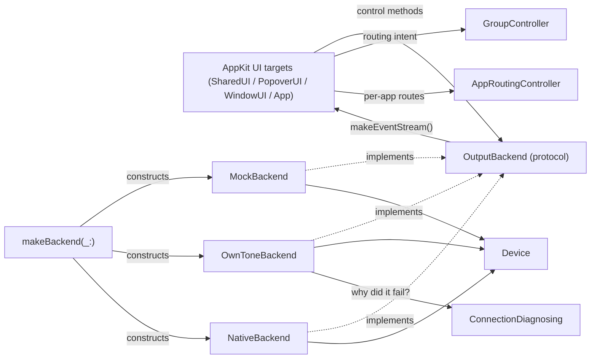

# AirPlayControllerCore

## Purpose

This Swift package is the whole app in one place. Its **library target**
(`AirPlayControllerCore`) is the platform-agnostic core: the `Device` model, the
`OutputBackend` seam that decouples UI from wherever audio actually goes, the
routing brain (`GroupController`, `AppRoutingController`) and its JSON persistence,
per-device connection status + diagnosis, a fully-working offline `MockBackend`,
the real in-process `NativeBackend` (drives `AirPlayEngine` — the shipping path,
`AIRPLAY_BACKEND=native`), and `OwnToneBackend` (a complete HTTP-polling
implementation against an external OwnTone server — not a stub, but superseded by
`NativeBackend` per the root AGENTS.md and not being carried forward). The package
**also** hosts the AppKit UI as separate targets (`AirPlayControllerSharedUI`,
`AirPlayControllerPopoverUI`, `AirPlayControllerWindowUI`,
`AirPlayControllerSettingsUI`) and the shipping menu-bar executable
(`AirPlayControllerApp`), plus offline harnesses. The core library target stays
UI-agnostic (no AppKit imports, verified); UI code lives only in the UI targets
that link against it.

Keep this file up to date when: `OutputBackend`'s protocol surface changes, a
backend implementation is added or its status changes (stub/superseded/shipping),
the routing model / demo fleet / event model changes shape, or a target is added
to / removed from `Package.swift`.

## Notable Patterns

- **`Device` is a value type; the backend is the only writer.** The UI never mutates
  a `Device` directly — it calls a backend method (`setVolume`, `setMuted`,
  `setOutputSet`) and reacts to the echoed `deviceUpdated` event. This is what keeps
  `MockBackend` and the real backend behaviorally identical from the UI's point of view.
  See [Device.swift](Sources/AirPlayControllerCore/Device.swift).
- **Events are the only channel.** There is no "poll `devices` and diff it" path.
  `BackendEvent` (`deviceAdded`/`deviceRemoved`/`deviceUpdated`/`level`/
  `systemVolumeChanged`) via `makeEventStream()` is how the UI learns about every
  state change, including the echo of its own control calls. See
  [OutputBackend.swift](Sources/AirPlayControllerCore/OutputBackend.swift).
  - **It is also how the backend talks UP without depending upwards.**
    `systemVolumeChanged` is the one case that isn't about a `Device`:
    `NativeBackend` owns the system-volume listener but sits BELOW the routing
    brain and must never call into `GroupController`. So it states the fact on
    this stream and `AppDelegate` — already where backend events meet app-level
    controllers — hands it to `GroupController.mirrorSystemVolumeToMainOut(_:)`.
    Reach for the same shape if a backend ever needs to tell the app something
    else it must not itself act on.
- **Connection status rides on `Device`.** `Device.connectionState` flows through the
  same `deviceUpdated` echo — the backend owns the state machine, the UI only reacts to
  transitions. Don't add a side channel for it.
- **No-op changes must not emit.** `MockBackend.mutate(_:_:)` compares before/after and
  only emits `deviceUpdated` if something actually changed — a call site setting volume
  to its current value is silent. Preserve this if you touch backend mutation logic
  (`MockBackendTests.testNoOpChangeDoesNotEmit` guards it).
- **`MockBackend` is single-queue-confined.** All mutable state is touched only on its
  private serial `queue`; `@unchecked Sendable` is justified by that discipline, not a
  workaround. Any new mutable state must go through `queue.async`/`queue.sync`.
- **`OutputBackend` is the only seam the app should depend on.** `makeBackend(_:)` in
  [OwnToneBackend.swift](Sources/AirPlayControllerCore/OwnToneBackend.swift) is the one
  place that knows about concrete backend types. New callers take an `OutputBackend`.
- **Capture is gated on intent, in the backend — never the UI.** `NativeBackend` runs
  its Core Audio process tap only while at least one real AP2 output is in the set
  (`reconcileCaptureGate()`, keyed on `expectedSelected` — the ids `setOutputSet` was
  last called with — deliberately not on availability, and deliberately not on
  `GroupController.isPassthrough`). The tap is `.mutedWhenTapped`: getting this wrong
  either silences the Mac in passthrough or streams captured audio to nothing. Don't
  re-wire capture to consult UI/routing state directly — `GroupController.applyRouting()`
  already excludes the local device from the output set it hands the backend, so
  passthrough reaches the gate as an empty set on its own; the two independently agree
  without either one depending on the other.
  - **Know exactly what `expectedSelected` contains: it is Selected Devices ∪ app-route
    redirect targets**, not the Selected set alone (`GroupController.applyRouting()` /
    `activateGroup()` union in `redirectOutputIDs()`). So **the gate opens — and the
    Mac goes silent — when an app is redirected even with NO device manually selected**,
    and because the tap is a single global mixdown, the WHOLE system mix streams to that
    device, not just the redirected app's audio. That is the known "per-app routing needs
    per-app capture streams" limitation (see In-Progress Work), **not a regression**: before
    the gate existed the tap ran unconditionally and muted the Mac always. Do NOT try to
    fix it by narrowing the gate — a redirect genuinely needs a session open, so the gate
    is right; the missing piece is per-app capture. Expect this to surprise you when
    reading `isPassthrough`, which still reports `true` in that state (it answers "is the
    SELECTED set just the Mac?", which stays correct).
- Device/backend/UI behavior is spec'd in [SPEC.md](../SPEC.md), particularly §8 (Phase 0
  feasibility findings) and §9 (UI design — device row, groups, per-app routing). Comments
  cite specific subsections; the connection-status design is `dev/notes/p1-connection-status-brief.md`.

## Architecture

`NativeBackend` has no `ConnectionDiagnosing` seam — the engine's completion IS the
evidence, so a native `.failed` device's cause is always `.unknown`.

## Folder Map

- [Sources/AirPlayControllerCore/](Sources/AirPlayControllerCore/) — the UI-free library:
  `Device`, `OutputBackend`/`BackendEvent`, `ConnectionState`/`ConnectionFailure`,
  `ConnectionDiagnostics`, `GroupController`, `AppRoutingController`, `RoutingStore`/
  `AppRouteStore`/`GroupStore`, `AppSettings`, `ExcludedAppsController`/
  `ExcludedAppsStore`, `MockBackend`, `OwnToneBackend` + `makeBackend`. The native path
  lives here too: `NativeBackend`, `NativeDiscovery`, `NativeCaptureCoordinator` (drives
  the sibling `AirPlayEngine` package), `SystemOutputVolume`. The OwnTone-era subprocess
  capture plumbing (`CaptureCoordinator`, `PlaybackController`, `FIFOManager`,
  `CaptureProcess`) is superseded by `NativeCaptureCoordinator` but still present.
- [Sources/AirPlayControllerSharedUI/](Sources/AirPlayControllerSharedUI/) — AppKit row
  views shared by popover + window: `DeviceRowView`, `StatusDotView`, `AppRowView`,
  `PopoverColumnGrid`.
- [Sources/AirPlayControllerPopoverUI/](Sources/AirPlayControllerPopoverUI/) — the menu-bar
  popover: `PopoverController`, `CardView`, `ConnectionDiagnosisView`, `MainOutRowView`,
  `GroupRowView`.
- [Sources/AirPlayControllerWindowUI/](Sources/AirPlayControllerWindowUI/) — the full mixer
  window (`MixerViewController`, `SidebarViewController`).
- [Sources/AirPlayControllerSettingsUI/](Sources/AirPlayControllerSettingsUI/) — the
  Settings window: `SettingsWindowController` hosting `GeneralSettingsViewController`/
  `AppearanceSettingsViewController`/`AudioSettingsViewController` (excluded apps + the
  Advanced audio-buffer control), plus the `LoginItem`/`RunningApps` seams.
- [Sources/AirPlayControllerApp/](Sources/AirPlayControllerApp/) — the shipping menu-bar app
  (`NSStatusItem` + popover); built into "AirPlay Controller.app" by `../scripts/make-app.sh`.
- [Sources/mock-speakers-demo/](Sources/mock-speakers-demo/) — headless CLI that drives
  `MockBackend` and prints every event.
- `Sources/popover-harness/`, `window-harness/`, `popover-snapshot/`, `settings-snapshot/`
  — offline structure-check + snapshot harnesses (assert the view tree / write PNGs with
  no on-screen UI).

## Key Types

| Type | Role |
|---|---|
| `Device` | Value-type snapshot of one AirPlay output (identity, kind, volume, mute/selected, `connectionState`). **Trap: `isSelected` means "in the backend's current output set" (streaming now) — it is NOT membership in the UI's Selected Devices set** (which lives in `GroupController.selectedDeviceIDs`). Row/menu toggle state must come from `GroupController.isSpeakerSelected(_:)`, not `device.isSelected`; both `PopoverController` and `MixerViewController` compute it explicitly and pass it as the `selected` argument to `DeviceRowView.apply(_:selected:controllable:blocked:blockReason:routedAppNames:)`. The gap is now WIDER than the name suggests: the output set is Selected ∪ redirect targets, so a redirect-only device reports `isSelected == true` while being in nobody's Selected Devices set. |
| `Device.Kind` | Receiver category — drives SF Symbol and AirPlay-1-vs-2 assumptions. |
| `ConnectionState` / `ConnectionFailure` | Live per-device connection lifecycle (`off`/`connecting`/`connected`/`reconnecting`/`failed`) + the plain-English cause behind a failure. Backend-owned, UI-rendered. See [ConnectionState.swift](Sources/AirPlayControllerCore/ConnectionState.swift). |
| `ConnectionDiagnosing` / `NetworkConnectionDiagnostics` | Protocol seam + real "why didn't it connect" — engine-log tail, Bonjour presence, TCP probe, auth flags, in that decision order. `OwnToneBackend`-only; `NativeBackend` has no diagnostics seam. See [ConnectionDiagnostics.swift](Sources/AirPlayControllerCore/ConnectionDiagnostics.swift). |
| `GroupController` | The routing brain: owns the persistent "Selected Devices" set (`selectedDeviceIDs` — the SPEC §9 rename; "Enabled Devices" survives only as the Main Out dropdown's user-facing title, `PopoverController`) + Main Out target + saved output groups; composes the set, resolves Main Out, saves/activates/dedups groups. **Redirect-connect (main, 432aa7d):** the backend output set is **Selected AirPlay devices ∪ app-route redirect targets** — composed at every `setOutputSet` call site via the injected `appRouteTargets` closure / `redirectOutputIDs()` helper, so an AirPlay session opens the moment an app is redirected. `mainOutMemberIDs` and the Main Out master deliberately EXCLUDE redirect targets (Q5 — a redirect must not move the system master). `groupMatchingCurrentSelection` is keyed off `mainOutMemberIDs` — the membership the Main Out target names (`selectedDeviceIDs` when targeting Selected Devices, the group's own members when targeting a group) — NOT the live output set (`Device.isSelected`), so a redirect-connected device can't pollute group matching (Q3). `reapplyRouting()` re-runs the union — call it after app routes change so the affected device connects or drops to `.off`. **Volume-key mirror (Alec, live session 2026-07-17):** `mirrorSystemVolumeToMainOut(_:)` takes an EXTERNAL system-volume change (fed by `BackendEvent.systemVolumeChanged` via `AppDelegate`) and scales the Main Out master onto it, so the macOS volume keys drive whatever is actually playing instead of the tap-muted local output. It refuses when the Main Out membership contains the local device — which is the whole no-feedback argument, since the local id is the ONLY one whose `setVolume` reaches `SystemVolumeControlling`. `!isPassthrough` alone is NOT that guarantee and must not be trusted as one: it is false for every `.group` target, and a group's members can include the Mac (`saveCurrentSetupAsGroup(name:id:)` in passthrough saves exactly such a group). It also holds ONE ratio snapshot across a keypress burst in `mirrorRatios` — re-deriving per step (what `setMainOutMasterVolume(_:)` does with no drag open) provably drifts once a member clamps at 100 or a burst passes through 0. The snapshot is held on evidence, not a timer: it records the volumes it commanded and re-derives the moment a member isn't where it left it, so any future path that moves a member invalidates it for free. **Launch default (Alec, 2026-07-17): the live routing set is NOT auto-resumed.** The init deliberately never reads `selectedDeviceIDs`/`mainOut` back from `routingStore` (write-only at launch); `ensureDefaultSelection()` seeds `{local}` = passthrough every launch, so a previously-selected AirPlay device never auto-streams on open. Saved GROUPS still persist and stay re-applyable — `loadPersisted` gates those, and must never again gate a routing resume. |
| `AppRoutingController` | Per-app routing state (sibling of `GroupController`): `appRoutes`, `addRoute(bundleID:displayName:)`/`setDestination(_:for:)`/`setVolume(_:for:)`/`removeRoute(bundleID:)`, `handleDeviceUnavailable(id:)` silent fallback. `routedAppNames(for:)` returns the app display names whose route destination is a given device, excluding `.currentDevice` routes, in stable route order — both UI hosts call it to populate the `DeviceRowView` routing sublabel AND to decide whether a device is a redirect target (grounding the row's `controllable` param). `AppDelegate` wires it into `GroupController.appRouteTargets` (assigned after construction — the var is publicly assignable precisely to break that init-order cycle). Persists via `AppRouteStore`. |
| `AppRouteStore` / `RoutingStore` / `GroupStore` | Versioned-JSON persistence (`app-routes.json` / routing / `groups.json`) in `Application Support/AirPlay Controller/`, schemaVersion-gated. `RoutingStore` is WRITE-ONLY at launch by design — see the `GroupController` launch-default note above. |
| `BackendEvent` | The single push channel backend→UI: device added/removed/updated, a level sample, or `systemVolumeChanged` — the Mac's system output volume moved OUTSIDE this app (volume keys / Sound menu). Only `NativeBackend` emits the last one, and only for a real gesture: echoes of our own writes never reach it (`SystemOutputVolume` suppresses those), a default-output SWITCH is filtered out (it reports a different device's existing level, not an intent), and an unmoved volume (mute-only change) doesn't emit. |
| `OutputBackend` | The seam between app and audio routing — implemented by `MockBackend`, `OwnToneBackend`, and `NativeBackend`. |
| `MockBackend` | Fully-working offline backend: fabricates a fleet, staggers discovery, emits levels, simulates dropout/reconnect, and runs scripted connect/fail/drop choreography (`ConnectScript`). |
| `OwnToneBackend` | A complete HTTP-polling `OutputBackend` against OwnTone's JSON API (poll `GET /api/outputs`/`GET /api/player`, optimistic echo + re-GET confirm, zombie de-select recovery) — not a stub. Superseded by `NativeBackend` as the shipping path (root AGENTS.md); its connection-state machine + injected `diagnostics: ConnectionDiagnosing?` are real, unlike `NativeBackend`. |
| `NativeBackend` | The shipping `OutputBackend` (`AIRPLAY_BACKEND=native`): drives the in-process `AirPlayEngine` plus app-owned `NativeDiscovery`, translating engine primitives into the `Device`/`BackendEvent` contract. Owns the capture gate (see Notable Patterns) and the local `local-mac` device's real volume/mute via `SystemOutputVolume` — including republishing a genuine outside change as `systemVolumeChanged` for the volume-key mirror. It applies the FILTERS for that (not a device switch, volume actually moved) but deliberately makes no routing decision: it doesn't know `GroupController` exists. |
| `NativeDiscovery` | App-owned Bonjour discovery for the native path: an `NWBrowser` wrapper browsing both `_airplay._tcp` (AirPlay 2) and `_raop._tcp` (AirPlay 1), producing `DiscoveredDevice`s keyed on the colon-hex `deviceid` (never reformatted). AP1-only receivers are surfaced dimmed (D6) but never driven — the engine is AP2-only. |
| `NativeCaptureCoordinator` | Owns the in-process Core Audio capture pipeline (T-NB-CAPTURE-1): creates a system-audio process tap, reads its real format, converts each buffer to the engine's fixed PCM format, and hands it off with a tap-clock timestamp. `NativeBackend` depends on it only through `CaptureControlling` (public solely because `captureCoordinator` is a public var), so the capture gate is testable with no Core Audio tap / TCC prompt. |
| `SystemOutputVolume` / `SystemVolumeControlling` | Reads/writes the volume + mute of the Mac's system default output device via Core Audio, with a listener for changes made outside the app (media keys, Sound menu, or the default device itself switching). The only control path for the local `local-mac` device row, which is not an engine output and has no `outputIDs` entry. Behind a protocol for the same hermetic-test reason as `ConnectionDiagnosing`. **`onExternalChange` fires ONLY for genuinely external changes** — echo suppression is state-based (fresh read vs last-known, updated on both write and report) precisely because one logical write fans out ~16 callbacks across 7 addresses, so a consume-once token can't work. That's why "volume keys" vs "user dragged our slider" needs no flag anywhere downstream. Its third argument, `defaultDeviceChanged`, separates a volume/mute GESTURE from the default output device itself switching: the latter reports a different device's pre-existing level, so anything acting on the value (the volume-key mirror) must ignore it — mirroring a headphone plug would slam every speaker to whatever the headphones sat at. Rendering the row uses both. |
| `makeBackend(_:)` | The one factory that knows concrete backend types (`mock`/`owntone`/`native`); everything else depends on `OutputBackend`. |

## In-Progress Work

| Area | Status |
|---|---|
| `OwnToneBackend` | Fully implemented (not a stub) — HTTP polling, zombie recovery, real connection-state + diagnostics wiring. Superseded by `NativeBackend` as the shipping path once Phase 2/2b built the in-process engine instead of continuing against an external OwnTone server; not being carried further. Historical pipe-input findings: `dev/notes/0f-pipe-brief.md`. |
| `NativeBackend` | The shipping backend (`AIRPLAY_BACKEND=native`). AP1-only receivers are discovered/shown but not driven (raop sender deferred, D6). One gated live-verification session with real hardware remains before it's production-ready (root AGENTS.md; `dev/notes/p2b-nativebackend-runbook.md`). |
| Per-app routing (`AppRoutingController`/`AppRouteStore`) | Model + persistence + UI COMPLETE (SPEC.md §9, PLAN-POPOVER-ROUTING.md T-1..T-8/T-11), and a redirect now **connects** its target device (`GroupController.appRouteTargets` ∪ into the output set). But it still does **not move that app's audio in isolation**: `NativeCaptureCoordinator`'s tap is a whole-system stereo mixdown (`CATapDescription(stereoGlobalTapButExcludeProcesses: [])`) — per-app streams are, per its own doc comment, "a later concern." **Consequence (see the capture-gate pattern above): redirecting ONE app streams the WHOLE system mix to that device and mutes the Mac.** Known limitation, not a regression — don't "fix" it in the gate; it needs per-app capture streams. |
| Routing sublabel / device row | COMPLETE in both hosts. `PopoverController` + `MixerViewController` pass `routedAppNames` (from `AppRoutingController.routedAppNames(for:)`) and `controllable` (`selected ‖ isRedirectTarget`) into `DeviceRowView.apply(...)`; `MixerViewController`/`MixerWindowController` gained an `AppRoutingController` param (defaulted to a non-persisting instance so existing call sites/tests still compile). The row renders ONE sublabel by precedence: failed → unavailable → routing line ("System · <apps>") → none. |
| Per-device connection status | COMPLETE against the mock; also real under `native` — `off`/`connecting`/`connected`/`failed` all driven from `setOutputSet`'s eager set plus `engine.makeStateStream()` transitions (no `.reconnecting`: a failed native session is parked, not retried). `NativeBackend` has no diagnostics seam, so a `.failed` cause is always `.unknown`; full `ConnectionDiagnosing` only runs under `OwnToneBackend`. |
| `AirPlayControllerApp` | A real menu-bar (`NSStatusItem`, `LSUIElement`) executable target — built into "AirPlay Controller.app" by `scripts/make-app.sh` (ad-hoc signed), runnable offline via `AIRPLAY_BACKEND=mock AIRPLAY_MOCK_SCENARIO=connection-demo`. NOT yet distributed/notarized. Moves real audio today via `AIRPLAY_BACKEND=native` — must run as the built `.app` (not bare `swift run`) to keep the TCC grant for the capture tap across rebuilds. |

## Tests

`Tests/AirPlayControllerCoreTests/`. `MockBackendTests` uses
`makeBackend(fleet:staggerDiscovery:false, emitsLevels:false, simulatesDropouts:false)`
for determinism and small private actors (`EventBox`/`DeviceBox`/`FlagBox`) to carry
state across the async event stream — reuse that pattern for new backend tests
(`NativeBackendTests` follows the same shape with a spy `EngineControlling`). The
popover/window/settings structure harnesses (`swift run popover-harness` /
`window-harness` / `settings-snapshot`) and `popover-snapshot` are the offscreen UI
checks; run them alongside `swift test`.

| File | Focus |
|---|---|
| `MockBackendTests` | Discovery, snapshot order, volume clamp/echo, `setOutputSet`, no-op-doesn't-emit. |
| `OwnToneBackendTests` | Connection-state transitions, diagnostics dispatch, post-stop resurrection guard. |
| `NativeBackendTests` | Hermetic native-backend behavior via a spy `EngineControlling` + injected `DiscoverySource`: discovery→`deviceAdded`, AP1 surfaced-never-added, out-of-band engine state→`deviceUpdated`, converge/coalescing, the mute shim, the capture gate, and local-device volume/mute via a fake `SystemVolumeControlling` (`FakeSystemVolume`, this file's default — no test here ever constructs a real `SystemOutputVolume`; `fireExternalChange(volume:muted:defaultDeviceChanged:)` simulates an outside change). Also the volume-key mirror's emit filters, and `testVolumeKeyMirrorDrivesAirPlayAndNeverWritesBackToSystemVolume` — the end-to-end no-feedback proof, which runs a real `GroupController` over the backend and asserts the mirror wrote NOTHING back to the system volume. |
| `ConnectionStateTests` / `ConnectionDiagnosticsTests` | Failure copy/equality; `NetworkConnectionDiagnostics` decision order. |
| `GroupControllerTests` | Selected-set composition, Main Out routing, group save/activate/dedup, persistence. Also the redirect union (Selected ∪ `appRouteTargets`, `reapplyRouting()` connect/drop, master + group-identity exclusion) and `testGroupsPersistButRoutingResetsToLocalOnLaunch` — the guard on the launch default: **groups persist, the live AirPlay routing set does not auto-resume.** The volume-key mirror lives here too, over a `WriteCountingBackend` (wraps `MockBackend`, records every `setVolume` — the only way to assert a BOUND on writes): master-follows-while-streaming, refusal in passthrough AND for a `.group` target containing the Mac, bounded writes, and burst stability through the 100 clamp and through 0. Note `testPerStepRatioRecomputationDriftsWhichIsWhyTheMirrorSnapshots`, which asserts the drift the snapshot prevents — if it ever goes green at the starting balance, the snapshot has stopped being load-bearing and the burst tests have gone vacuous. |
| `AppRoutingControllerTests` / `AppRouteStoreTests` | Per-app route model + silent fallback + `routedAppNames(for:)` ordering/filtering; JSON persistence round-trip + schema gating. |
| `AppSettingsTests` / `ExcludedAppsTests` | `AppSettings` (theme/density/start-buffer) and the excluded-apps list: defaults, round-trip, forward-compat fallback on an unrecognized stored value. |
| `PopoverControllerTests` | Popover build, collapsible cards, Applications card, connection-status flow + diagnosis panels. |
| `PopoverExcludedAppsTests` | An excluded app is dropped from the popover's "+ Add application…" picker and its route row is skipped on rebuild. |
| `DeviceRowConnectionStateTests` / `DeviceRowUnsupportedTests` / `ConnectionDiagnosisViewTests` / `AppRowViewTests` | Row status badge per state + the sublabel precedence ladder (failed → unavailable → routing line) and `controllable` slider/mute enabling; AP1-only dimming/disabled row + "coming soon" click explanation; failure-panel copy/actions; app-row config. |
| `MixerWindowControllerTests` | Full mixer-window wiring (shared row reuse). |
| `SettingsWindowControllerTests` / `AudioSettingsLatencyTests` | Settings window structure via `test_` hooks (General/Appearance/Audio panes fit on one screen); the Advanced audio-buffer control specifically (numeric options, apply round-trip, CTA arming, env-override disabled state). |
| `CaptureCoordinatorTests` / `BackendKindResolutionTests` | OwnTone-path capture-tap coordination; `makeBackend` kind resolution (mock/owntone/native) + the native start-buffer env-override/settings resolution. |
| `NativeCaptureCoordinatorTests` | Hermetic native capture pipeline via a fake `SystemAudioTap`/`PCMSink`/`PCMConverting`: create→buffer→convert→forward→device-change→stop, plus a focused tap-clock-domain regression test. |
| `NativeDiscoveryTests` / `NativeDiscoveryLiveTests` | Hermetic AP2/AP1 discovery, classification, and colon-hex id round-trip via an injected `ServiceBrowsing` double; `*Live` is a real-LAN opt-in (`AIRPLAY_LIVE_DISCOVERY=1`), skipped by default. |
