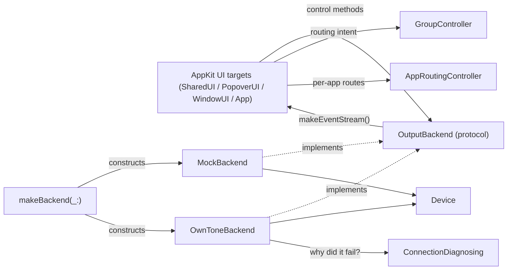

# AirPlayControllerCore

## Purpose

This Swift package is the whole app in one place. Its **library target**
(`AirPlayControllerCore`) is the platform-agnostic core: the `Device` model, the
`OutputBackend` seam that decouples UI from wherever audio actually goes, the
routing brain (`GroupController`, `AppRoutingController`) and its JSON persistence,
per-device connection status + diagnosis, a fully-working offline `MockBackend`,
and an unimplemented `OwnToneBackend` stub. The package **also** hosts the AppKit
UI as separate targets (`AirPlayControllerSharedUI`, `AirPlayControllerPopoverUI`,
`AirPlayControllerWindowUI`) and the shipping menu-bar executable
(`AirPlayControllerApp`), plus offline harnesses. The core library target stays
UI-agnostic (no AppKit imports, verified); UI code lives only in the UI targets
that link against it.

Keep this file up to date when: `OutputBackend`'s protocol surface changes, a
backend implementation is added, `OwnToneBackend` moves from stub to real, the
routing model / demo fleet / event model changes shape, or a target is added to /
removed from `Package.swift`.

## Notable Patterns

- **`Device` is a value type; the backend is the only writer.** The UI never mutates
  a `Device` directly — it calls a backend method (`setVolume`, `setMuted`, `setSoloed`,
  `setOutputSet`) and reacts to the echoed `deviceUpdated` event. This is what keeps
  `MockBackend` and the real backend behaviorally identical from the UI's point of view.
  See [Device.swift](Sources/AirPlayControllerCore/Device.swift).
- **Events are the only channel.** There is no "poll `devices` and diff it" path.
  `BackendEvent` (`deviceAdded`/`deviceRemoved`/`deviceUpdated`/`level`) via
  `makeEventStream()` is how the UI learns about every state change, including the
  echo of its own control calls. See [OutputBackend.swift](Sources/AirPlayControllerCore/OutputBackend.swift).
- **Connection status rides on `Device`.** `Device.connectionState` flows through the
  same `deviceUpdated` echo — the backend owns the state machine, the UI only reacts to
  transitions. Don't add a side channel for it.
- **No-op changes must not emit.** `MockBackend.mutate(_:_:)` compares before/after and
  only emits `deviceUpdated` if something actually changed — a call site setting volume
  to its current value is silent. Preserve this if you touch backend mutation logic
  (`MockBackendTests.testNoOpChangeDoesNotEmit` guards it).
- **`MockBackend` is single-queue-confined.** All mutable state is touched only on its
  private serial `queue`; `@unchecked Sendable` is justified by that discipline, not a
  workaround. Any new mutable state must go through `queue.async`/`queue.sync`.
- **`OutputBackend` is the only seam the app should depend on.** `makeBackend(_:)` in
  [OwnToneBackend.swift](Sources/AirPlayControllerCore/OwnToneBackend.swift) is the one
  place that knows about concrete backend types. New callers take an `OutputBackend`.
- Device/backend/UI behavior is spec'd in [SPEC.md](../SPEC.md), particularly §8 (Phase 0
  feasibility findings) and §9 (UI design — device row, groups, per-app routing). Comments
  cite specific subsections; the connection-status design is `dev/notes/p1-connection-status-brief.md`.

## Architecture

## Folder Map

- [Sources/AirPlayControllerCore/](Sources/AirPlayControllerCore/) — the UI-free library:
  `Device`, `OutputBackend`/`BackendEvent`, `ConnectionState`/`ConnectionFailure`,
  `ConnectionDiagnostics`, `GroupController`, `AppRoutingController`, `RoutingStore`/
  `AppRouteStore`, `CaptureCoordinator`, `MockBackend`, `OwnToneBackend` + `makeBackend`.
- [Sources/AirPlayControllerSharedUI/](Sources/AirPlayControllerSharedUI/) — AppKit row
  views shared by popover + window: `DeviceRowView`, `StatusDotView`, `AppRowView`,
  `PopoverColumnGrid`.
- [Sources/AirPlayControllerPopoverUI/](Sources/AirPlayControllerPopoverUI/) — the menu-bar
  popover: `PopoverController`, `CardView`, `ConnectionDiagnosisView`, `MainOutRowView`,
  `GroupRowView`.
- [Sources/AirPlayControllerWindowUI/](Sources/AirPlayControllerWindowUI/) — the full mixer
  window (`MixerViewController`, `SidebarViewController`).
- [Sources/AirPlayControllerApp/](Sources/AirPlayControllerApp/) — the shipping menu-bar app
  (`NSStatusItem` + popover); built into "AirPlay Controller.app" by `../scripts/make-app.sh`.
- [Sources/mock-speakers-demo/](Sources/mock-speakers-demo/) — headless CLI that drives
  `MockBackend` and prints every event.
- `Sources/popover-harness/`, `window-harness/`, `popover-snapshot/` — offline structure-check
  + snapshot harnesses (assert the view tree / write PNGs with no on-screen UI).

## Key Types

| Type | Role |
|---|---|
| `Device` | Value-type snapshot of one AirPlay output (identity, kind, volume, mute/solo/selected, `connectionState`). **CRITICAL: `Device.isSelected` is a BACKEND OUTPUT flag — it means "this device is in the current backend output set" (currently being streamed to). This is NOT the same as "membership in the Selected Devices set" (which lives in `GroupController.selectedDeviceIDs`). The UI uses the latter to render toggle state; the row view receives it as the explicit `selected: Bool` parameter to `apply(...)`, NOT from `device.isSelected`. Future agents: never read `device.isSelected` to populate the row toggle or menu state — use the `selected` parameter or query `GroupController.selectedDeviceIDs` directly.** |
| `Device.Kind` | Receiver category — drives SF Symbol and AirPlay-1-vs-2 assumptions. |
| `ConnectionState` / `ConnectionFailure` | Live per-device connection lifecycle (`off`/`connecting`/`connected`/`reconnecting`/`failed`) + the plain-English cause behind a failure. Backend-owned, UI-rendered. See [ConnectionState.swift](Sources/AirPlayControllerCore/ConnectionState.swift). |
| `ConnectionDiagnosing` / `NetworkConnectionDiagnostics` | Protocol seam + real "why didn't it connect" — engine-log tail, Bonjour presence, TCP probe, auth flags, in that decision order. See [ConnectionDiagnostics.swift](Sources/AirPlayControllerCore/ConnectionDiagnostics.swift). |
| `GroupController` | The routing brain: owns the persistent "Enabled Devices" set + Main Out target + saved output groups; composes the set, resolves Main Out, saves/activates/dedups groups. **NEW (redirect-connect-and-controls):** the backend output set is now **Selected AirPlay devices ∪ app-route redirect targets** — composed at every `setOutputSet` call site via the injected `appRouteTargets` closure / `redirectOutputIDs()` helper. `mainOutMemberIDs` and the Main Out master deliberately EXCLUDE redirect targets (Q5 — a redirect must not move the system master). `groupMatchingCurrentSelection` is keyed off `selectedDeviceIDs` (not `Device.isSelected`), so a redirect-connected device does not pollute group matching (Q3). Public surface now includes `reapplyRouting()` — call after app routes change to recompute the redirect-target union and reconnect/disconnect affected devices. |
| `AppRoutingController` | Per-app routing state (sibling of `GroupController`): `appRoutes`, `setAppRoute`/`setAppVolume`/`removeAppRoute`, `handleDeviceUnavailable(id:)` silent fallback. `routedAppNames(for:)` helper computes app display names whose route destination is a specific device (bypassed to it), excluding `.currentDevice` routes, in stable route order — both UI hosts call this to populate the `DeviceRowView` routing sublabel AND to check if a device is a redirect target (grounds the view's `controllable` param). Via AppDelegate's wiring, this also backs the Core's `appRouteTargets` closure that feeds the connect union. Persists via `AppRouteStore`. |
| `AppRouteStore` / `RoutingStore` | Versioned-JSON persistence (`app-routes.json` / routing) in `Application Support/AirPlay Controller/`, schemaVersion-gated. |
| `BackendEvent` | The single push channel backend→UI: device added/removed/updated, or a level sample. |
| `OutputBackend` | The seam between app and audio routing — implemented by `MockBackend` and `OwnToneBackend`. |
| `MockBackend` | Fully-working offline backend: fabricates a fleet, staggers discovery, emits levels, simulates dropout/reconnect, and runs scripted connect/fail/drop choreography (`ConnectScript`). |
| `OwnToneBackend` | Stub for the real backend — control methods still `unimplemented()`, but its connection-state machine + injected `diagnostics: ConnectionDiagnosing?` are real. |
| `makeBackend(_:)` | The one factory that knows concrete backend types; everything else depends on `OutputBackend`. |

## In-Progress Work

| Area | Status |
|---|---|
| **EAGER-CONNECT HAZARD — read before landing per-app capture** | `GroupController` unions `redirectOutputIDs()` (app-route redirect targets) into `backend.setOutputSet(...)` at **both** call sites — `applyRouting()` (Selected-Devices path, GroupController.swift:293) and `activateGroup(id:)` (group path, GroupController.swift:461). This means an AirPlay session opens the MOMENT an app is redirected to a device, with **no per-app audio capture behind it** (`CaptureCoordinator` is still a single global tap, and `OwnToneBackend`'s control methods are `unimplemented()`). Harmless today because the only working backend is `MockBackend` (mock-only, moves no real audio). **But the instant someone implements per-app capture without also gating the connect union on "this device's dedicated capture stream exists," a redirected device will start receiving the WHOLE SYSTEM MIX, not just that one app's audio** — silently, because `setOutputSet` has no concept of per-app streams today. Whoever lands per-app capture MUST wire the connect union so it only fires once that device's capture stream is live, not merely once an app route is set. |
| `OwnToneBackend` | Control methods (`start()`/`setVolume`/`setMuted`/`setSoloed`/`setOutputSet`) still call `unimplemented()` — real implementation is Phase 0d/0f → Phase 1 per SPEC.md §5, blocked on physical speaker access (mock rig is primary dev target). The connection-state machine + diagnostics wiring are implemented independently. Pipe-input findings: `dev/notes/0f-pipe-brief.md`. |
| Per-app routing (`AppRoutingController`/`AppRouteStore`) | UI + model + persistence COMPLETE (SPEC.md §9, PLAN-POPOVER-ROUTING.md T-1..T-8/T-11). Routes persist and render but move no audio yet — wired against `MockBackend`; blocked on the native engine gaining per-app capture streams (`CaptureCoordinator` is a single global tap today). Device-row routing sublabel now wired: both popover + window hosts pass `routedAppNames` (computed from `AppRoutingController.routedAppNames(for:)`) into `DeviceRowView.apply(...)`. |
| Per-device connection status | COMPLETE against the mock: on-icon `StatusDotView` badge + inline `ConnectionDiagnosisView`, driven by `OwnToneBackend`'s state machine + `NetworkConnectionDiagnostics`. Real signals arrive once `OwnToneBackend` is live. |
| `AirPlayControllerApp` | A real menu-bar (`NSStatusItem`, `LSUIElement`) executable target — built into "AirPlay Controller.app" by `scripts/make-app.sh` (ad-hoc signed), runnable offline via `AIRPLAY_BACKEND=mock AIRPLAY_MOCK_SCENARIO=connection-demo`. NOT yet distributed/notarized, and moves no real audio until `OwnToneBackend` lands. |
| Routing sublabel / Device row UI | Window host `MixerViewController` / `MixerWindowController` now accept an `AppRoutingController` to render per-device routing sublabels (popover already had it). Both hosts pass it to `DeviceRowView.apply(...)` alongside the existing `selected`/`blocked`/`blockReason` params. |

## Tests

`Tests/AirPlayControllerCoreTests/`. `MockBackendTests` uses
`makeBackend(fleet:staggerDiscovery:false, emitsLevels:false, simulatesDropouts:false)`
for determinism and small private actors (`EventBox`/`DeviceBox`/`FlagBox`) to carry
state across the async event stream — reuse that pattern for new backend tests. The
popover/window structure harnesses (`swift run popover-harness` / `window-harness`) and
`popover-snapshot` are the offscreen UI checks; run them alongside `swift test`.

| File | Focus |
|---|---|
| `MockBackendTests` | Discovery, snapshot order, volume clamp/echo, `setOutputSet`, no-op-doesn't-emit. |
| `OwnToneBackendTests` | Connection-state transitions, diagnostics dispatch, post-stop resurrection guard. |
| `ConnectionStateTests` / `ConnectionDiagnosticsTests` | Failure copy/equality; `NetworkConnectionDiagnostics` decision order. |
| `GroupControllerTests` | Enabled-set composition, Main Out routing, group save/activate/dedup, persistence. |
| `AppRoutingControllerTests` / `AppRouteStoreTests` | Per-app route model + silent fallback; JSON persistence round-trip + schema gating. |
| `PopoverControllerTests` | Popover build, collapsible cards, Applications card, connection-status flow + diagnosis panels. |
| `DeviceRowConnectionStateTests` / `ConnectionDiagnosisViewTests` / `AppRowViewTests` | Row status badge per state; failure-panel copy/actions; app-row config. |
| `MixerWindowControllerTests` | Full mixer-window wiring (shared row reuse). |
| `CaptureCoordinatorTests` / `BackendKindResolutionTests` | Capture-tap coordination; `makeBackend` kind resolution. |
