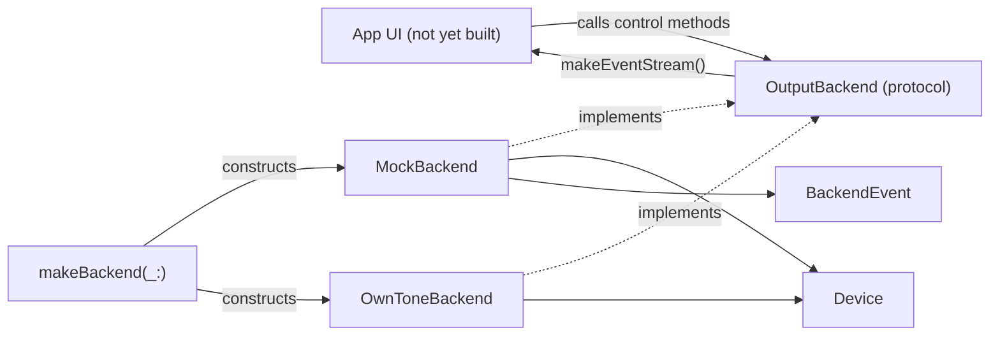

# AirPlayControllerCore

## Purpose

This Swift package is the platform-agnostic core of the AirPlay Controller app: it
defines the `Device` model, the `OutputBackend` protocol that decouples the (future)
AppKit UI from wherever audio actually goes, a fully-working `MockBackend` for offline
UI development, and an unimplemented `OwnToneBackend` stub for the real speaker
integration. It owns no UI code (no AppKit/SwiftUI imports) — that lives in a
not-yet-created app target that will link against this library.

Keep this file up to date when: `OutputBackend`'s protocol surface changes, a new
backend implementation is added, `OwnToneBackend` moves from stub to real
implementation, or the demo fleet / event model changes shape.

## Notable Patterns

- **`Device` is a value type; the backend is the only writer.** The UI never mutates
  a `Device` directly — it calls a backend method (`setVolume`, `setMuted`, `setSoloed`,
  `setOutputSet`) and reacts to the echoed `deviceUpdated` event. This is what keeps
  `MockBackend` and the real backend behaviorally identical from the UI's point of view.
  See [Device.swift](Sources/AirPlayControllerCore/Device.swift).
- **Events are the only channel.** There is no "poll `devices` and diff it" path.
  `BackendEvent` (`deviceAdded`/`deviceRemoved`/`deviceUpdated`/`level`) via
  `makeEventStream()` is how the UI learns about every state change, including the
  echo of its own control calls. See [OutputBackend.swift](Sources/AirPlayControllerCore/OutputBackend.swift).
- **No-op changes must not emit.** `MockBackend.mutate(_:_:)` compares before/after and
  only emits `deviceUpdated` if something actually changed — a call site setting volume
  to its current value is silent. Preserve this if you touch backend mutation logic
  (`MockBackendTests.testNoOpChangeDoesNotEmit` guards it).
- **`MockBackend` is single-queue-confined.** All mutable state is touched only on its
  private serial `queue`; `@unchecked Sendable` is justified by that discipline, not a
  workaround. Any new mutable state must go through `queue.async`/`queue.sync`, not be
  accessed directly.
- **`OutputBackend` is the only seam the app should depend on.** `makeBackend(_:)` in
  [OwnToneBackend.swift](Sources/AirPlayControllerCore/OwnToneBackend.swift) is the one
  place that knows about concrete backend types (`MockBackend` vs `OwnToneBackend`).
  New callers should take an `OutputBackend`, never a concrete type.
- Device/backend behavior is spec'd in [SPEC.md](../SPEC.md), particularly §8 (Phase 0
  feasibility findings, e.g. Sonos AirPlay-2/PTP requirement) and §9 (UI design — device
  row, groups, interaction model). Comments in this package cite specific subsections.

## Architecture

## Folder Map

- [Sources/AirPlayControllerCore/](Sources/AirPlayControllerCore/) — the library: `Device`,
  `OutputBackend`/`BackendEvent`, `ConnectionState`/`ConnectionFailure`,
  `ConnectionDiagnostics` (`NetworkConnectionDiagnostics`), `MockBackend`,
  `OwnToneBackend` + `makeBackend`.
- [Sources/mock-speakers-demo/](Sources/mock-speakers-demo/) — headless CLI executable
  (`swift run mock-speakers-demo`) that drives `MockBackend` and prints every event, for
  watching backend behavior with no UI.
- [Tests/AirPlayControllerCoreTests/](Tests/AirPlayControllerCoreTests/) — `MockBackend`
  behavioral tests.

## Key Types

| Type | Role |
|---|---|
| `Device` | Value-type snapshot of one AirPlay output (identity, kind, volume, mute/solo/selected state, `connectionState`). |
| `Device.Kind` | Receiver category (`homePod`, `appleTV`, `airportExpress`, `sonos`, `generic`) — drives SF Symbol and AirPlay-1-vs-2 assumptions. |
| `ConnectionState` / `ConnectionFailure` | Live per-device connection lifecycle (`off`/`connecting`/`connected`/`reconnecting`/`failed(ConnectionFailure)`) and the plain-English cause+suggestion behind a failure. Backend-owned, UI-rendered — see [ConnectionState.swift](Sources/AirPlayControllerCore/ConnectionState.swift) and `dev/notes/p1-connection-status-brief.md`. |
| `ConnectionDiagnosing` / `NetworkConnectionDiagnostics` | Protocol seam + real implementation for "why didn't it connect" — engine-log tail, Bonjour presence, TCP probe, auth flags, in that decision order. See [ConnectionDiagnostics.swift](Sources/AirPlayControllerCore/ConnectionDiagnostics.swift). |
| `BackendEvent` | The single push channel from backend to UI: device added/removed/updated, or a level-meter sample. |
| `OutputBackend` | Protocol seam between the app and audio routing — implemented by `MockBackend` and `OwnToneBackend`. |
| `MockBackend` | Fully-working offline backend: fabricates a fleet, staggers discovery, emits level samples, can simulate dropout/reconnect. |
| `OwnToneBackend` | Stub for the real backend (OwnTone JSON API + AirPlay-2 sender) — `start()`/`setVolume`/`setMuted`/`setSoloed`/`setOutputSet` are still `unimplemented()`/assert. Its connection-state machine (`connectionStates` dict, transition hooks off `setOutputSet`/`confirmSelectionOrRecover`/`applyPoll`, injected `diagnostics: ConnectionDiagnosing?`) is real, though — see §3 of `dev/notes/p1-connection-status-brief.md`. |
| `makeBackend(_:)` | The one factory function that knows about concrete backend types; everything else depends on `OutputBackend`. |

## In-Progress Work

| Area | Status |
|---|---|
| `OwnToneBackend` | Control methods (`start()`/`setVolume`/`setMuted`/`setSoloed`/`setOutputSet`) still call `unimplemented()` (assertion failure) — real implementation is Phase 0d/0f → Phase 1 work per SPEC.md §5, blocked on physical speaker access (see project memory: speakers currently unavailable, mock rig is primary dev target). The connection-state machine and diagnostics wiring (`dev/notes/p1-connection-status-brief.md`) are implemented independently of that gap. OwnTone pipe-input rate/autostart findings are captured in `dev/notes/0f-pipe-brief.md` at the repo root, not in this package. |
| AppKit app target | Not yet created — this package is pure logic today; nothing in the repo links against it as a UI. |

## Tests

| File | Focus |
|---|---|
| [MockBackendTests.swift](Tests/AirPlayControllerCoreTests/MockBackendTests.swift) | Discovery emits the whole fleet; `devices` snapshot matches fleet order after discovery; `setVolume` clamps to 0–100 and echoes `deviceUpdated`; `setOutputSet` selects exactly the given ids; no-op changes don't emit. Uses `makeBackend(fleet:staggerDiscovery: false, emitsLevels: false, simulatesDropouts: false)` for determinism, and small private actors (`EventBox`/`DeviceBox`/`FlagBox`) to carry state across the async event stream. |
