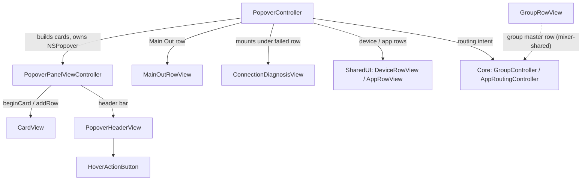

# AirPlayControllerPopoverUI

## Purpose

The menu-bar **popover** UI (pure AppKit) — the dropdown that appears from the
status item. `PopoverController` is the orchestrator: it owns the `NSPopover`,
builds a three-card stack, receives `Device` snapshots via `update(devices:)`,
and drives the injected `GroupController` (Enabled Devices set + Main Out routing)
and `AppRoutingController` (per-app routes). All routing arithmetic lives in Core
(see [../../AGENTS.md](../../AGENTS.md)); this folder only renders state and
turns clicks into controller calls. Shared row views (`DeviceRowView`,
`AppRowView`, `StatusDotView`, `PopoverColumnGrid`) live in
[../AirPlayControllerSharedUI/](../AirPlayControllerSharedUI/) and are
documented there.

Keep up to date when: the card set / order changes, the collapse-default policy
changes, the connection-transition → diagnosis-panel model changes, the Main Out
selector or header actions change, or a `test_` hook's contract changes.

## Notable Patterns

- **Transitions, not polling.** `PopoverController` keeps `lastConnectionStates`
  and reacts only to `Device.connectionState` EDGES: `→ .failed` removes the
  device from the Enabled set (the honest toggle animates back OFF) and
  auto-expands its diagnosis panel once per failure episode; `→ .connected`/`.off`
  tears the panel down. `.failed(guess) → .failed(diagnosed)` is the same episode
  (see `ConnectionState.isFailedState`) and must not re-run cleanup.
- **The diagnosis panel is purely auto-driven.** `openDiagnosisIDs` is the
  persistent intent (survives `rebuild()`); `reconcileDiagnosisPanels` makes the
  mounted `ConnectionDiagnosisView`s match it. There is no manual toggle — the
  warning-button slot was retired 2026-07-17. "Try again" == re-adding to the
  Enabled set (the toggle-on path IS the retry path).
- **The panel is a pure function of controller state.** Every delegate callback
  mutates the controller then calls `rebuild()`; rows are never mutated in place
  after a structural change. Exceptions are the in-place refreshers
  (`refreshDeviceRows`/`refreshMainOutRow`) used for mid-open repaints.
- **Collapse state is keyed by display header title.** `transientCollapsed` (in
  the controller) and `cardsByHeader` (in the panel) both key off the exact
  header string — so `collapsed:`/`toggleCard`/`setCardCollapsed` must pass the
  same title the card was built with (`"System"`, `"Devices"`, `"Applications"`).
- **Two rebuild flavors.** `rebuildForOpen()` (popover OPEN + `test_simulateOpen`)
  recomputes collapse defaults and discards this open's manual toggles; a plain
  `rebuild()` (device updates, route/Main-Out changes) preserves them. Don't
  swap one for the other.
- **Exact-fit sizing, no scroll view.** The panel has no `NSScrollView`; height
  flows through `preferredContentSize` (`panelContentDidChangeHeight`). The stack
  MUST stay pinned top AND bottom or Auto Layout collapses it to zero (see the
  trap note in `PopoverPanelViewController.loadView`).
- **The host owns the pasteboard.** `ConnectionDiagnosisView` never touches
  `NSPasteboard`; "Copy details" fires `onCopyDetails`, and the controller writes.

## Architecture

## Feature Flow

1. **Open** — `toggle(relativeTo:)` calls `rebuildForOpen()` (recompute collapse
   defaults, clear this open's toggles), settles size while hidden, then shows.
2. **Build cards** — `rebuild()` clears rows and builds three cards via
   `panel.beginCard`: **System** (the `MainOutRowView`), **Devices** (Current
   Device + AirPlay Devices sub-sections, each an Enabled toggle), **Applications**
   (one `AppRowView` per route + an "+ Add application…" row). Open diagnosis
   panels are re-mounted from `openDiagnosisIDs`.
3. **Toggle a device** — the row's Enabled switch → `didToggleEnabled` →
   `groupController.setDeviceSelected` → `handleSelection` presents any refusal
   and repaints. This composes the Enabled set; it only routes when Main Out
   targets Enabled Devices.
4. **Connecting / connected** — backend pushes `update(devices:)`;
   `handleConnectionTransitions` sees the edges. In-flight states leave any open
   panel alone.
5. **Failed** — on `→ .failed`, the device is dropped from the Enabled set and
   `openDiagnosisIDs` gains its id.
6. **Diagnosis panel** — `reconcileDiagnosisPanels` mounts a
   `ConnectionDiagnosisView` under the failed row (`panel.insertRow(after:)`).
   "Try again" re-adds membership; "Copy details" fires the host copy. On recovery
   or removal the panel is torn down.

## Key Types

| Type | Role |
|---|---|
| `PopoverController` | Orchestrator: owns the `NSPopover`, builds cards, ingests `Device` snapshots, drives `GroupController`/`AppRoutingController`, and reacts to connection-state transitions. Hosts the many `test_` hooks. |
| `PopoverPanelViewController` | Card container inside the popover's content VC: `beginCard`/`addRow`/`addSubsectionHeader`, collapse/expand + exact-fit sizing, `insertRow`/`removeRow` for the diagnosis panel. Keys cards by header title. |
| `CardView` | One rounded Control-Center-style module: header rows + a clipping collapsible body (`setBodyCollapsed`), drop shadow + raised-edge rim chrome. |
| `MainOutRowView` | The System card's Main Out row: master slider + `%` + mute + the named destination dropdown ("Enabled Devices" / saved groups) — THE routing control. |
| `ConnectionDiagnosisView` | Inline "Couldn't connect" panel under a failed device row: cause + suggestion + Try again / Copy details. Pure renderer of a `ConnectionFailure`. |
| `PopoverHeaderView` | Top bar: centered title + Groups-editor / Settings / Quit icon buttons (callbacks only; Settings is a `// TODO` stub). |
| `HoverActionButton` | Borderless icon button with a hover wash and pointer-reconciled hover (used by the header and card `+` accessories). |
| `GroupRowView` | A saved group's master row (activate + chevron + name + master slider). Built for the mixer window's group section — the popover no longer renders a Groups section, so it is unused by `PopoverController` here. |
| `RunningAppInfo` | Plain-value snapshot of a running app for the "+ Add application…" picker (icon-independent `Equatable`). |

## Tests

`Tests/AirPlayControllerCoreTests/` + the offscreen `swift run popover-harness`
structure check. Exercise via the `test_` hooks (they drive the same code paths
as real gestures without a live `NSPopover`).

| Target | Focus |
|---|---|
| `PopoverControllerTests` | Card build/order, collapsible-card defaults + transient state (`test_simulateOpen`/`test_toggleCard`), Applications card (rows, destinations, slider dimming), Main Out selection/master, connection-transition flow + diagnosis panels (`test_diagnosisPanel`/`test_tapRetry`), running-app picker. |
| `popover-harness` | Offscreen assertion of the assembled panel view tree + exact-fit sizing (`test_panelView`/`test_panelFittingSize`/`test_preferredContentSize`). |
