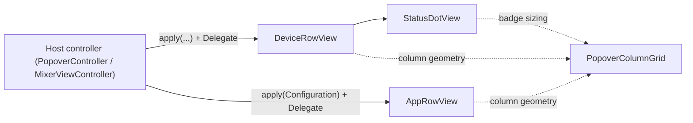

# AirPlayControllerSharedUI

## Purpose

AppKit row views SHARED by both the menu-bar **popover** (`AirPlayControllerPopoverUI`) and the full **mixer window** (`AirPlayControllerWindowUI`). This target exists so the window can link the one device-row implementation without pulling in the whole dropdown — "same row component, one test surface, identical behaviour in both hosts." Every view here is **pure UI**: controls route back through a per-view `Delegate` (or closure); no view talks to a backend, store, or `GroupController`. For the Device / backend / routing model these rows render, see [../../AGENTS.md](../../AGENTS.md).

**Keep up to date when:** a row's control set / layout column changes, `PopoverColumnGrid` constants move, the connection-status badge or sublabel rendering changes, a device-row sublabel scheme is revised, or a new shared row type lands here.

## Notable Patterns

- **Trailing-anchored shared grid.** All row types anchor their slider + trailing-control columns to fixed distances from the row's *trailing* edge (not leading), so columns line up across sections despite different leading controls. The name label is the flexible column that truncates. All geometry lives in `PopoverColumnGrid` — no magic numbers in the row views.
- **`apply(...)` is the only inbound seam.** Hosts push a plain-value snapshot in; the view never reads shared model state itself. `DeviceRowView` takes membership (`selected`) explicitly because it lives in `GroupController`, not on `Device`. `AppRowView` takes an isolated `Configuration` (no `AppRoute`/store dependency).
- **Sticky-hover discipline.** Transient hover is kept separate from model state, cleared on every `apply` and on re-parenting, and reconciled against the true pointer position via an app-local `.mouseMoved` monitor — an `NSTrackingArea` alone never fires `mouseExited` for a bottom-most row with an untracked dead-zone below it. `DeviceRowView`, `AppRowView`, and `RowHoverButton` each implement this.
- **Host-aware drawing (`DeviceRowView` only).** Computes `isInMenu` live from `enclosingMenuItem`: paints the system menu highlight itself in a menu, paints a rounded selection/hover pill in a menu-less host (popover card / window), and switches its accessibility role (`.menuItem` vs `.group`) to match.
- **`test_*` hooks everywhere.** Headless tests can't synthesize real drags/clicks, so each view exposes `test_setVolume`, `test_toggleEnabled`, `test_reconcileHover`, `test_statusKind`, etc. that drive the exact same delegate/state paths as the real controls.
- **On-icon status redesign (2026-07-17).** Connection status is a corner dot ON the icon (`StatusDotView`), not a right-side slot. The name is single-line and centered except when a sublabel is shown (failed "Couldn't connect" → unavailable "Unavailable" → routing "System · <app> · <app2>" → none). The icon is neutral (`.secondaryLabelColor`, no accent fill); clicking the name toggles the new Selected checkbox. The "ENABLED" column header is now "Selected"; the control is an `NSButton` checkbox (not `NSSwitch`), centered in the same trailing slot. Column header and checkbox semantics are unchanged — both represent membership in the Selected Devices set.
- **Native hover (2026-07-17).** The "Add application…" row and popover header icon buttons (groups / settings / quit) draw a neutral, system-drawn Control-Center-style rounded highlight on hover (appearance- and accent-aware, not accent-blue). The "Add application…" row uses a dedicated `NeutralHoverButton` (distinct from the app-remove ✕'s `RowHoverButton`, which is unchanged). Do NOT touch the device-row selection pill.

## Architecture

## Key Types

| Type | File | Role |
|---|---|---|
| `DeviceRowView` | `DeviceRowView.swift` | The one shared device row (icon · name [+ sublabel] · mute · slider · % · Selected checkbox), hosted by BOTH popover and window. `Delegate` callbacks: `didSetVolume` / `didToggleMute` / `didToggleEnabled` (primary "send audio here" routing). `StatusKind` mirrors the on-icon dot. The `apply(_:selected:controllable:blocked:blockReason:routedAppNames:)` method gains a NEW `controllable: Bool = false` parameter (inserted after `selected`): slider + mute enable off `controllable` (= `isSpeakerSelected(id) ∥ isRedirectTarget(id)`), while the checkbox `.on/.off` and the "System" routing token stay keyed off `selected` alone — so a redirect-only device is controllable with checkbox OFF and no "System" token. The `routedAppNames: [String] = []` parameter (app display names routed to this device, in stable order); the View prepends "System" when `selected` is true and synthesizes a routing sublabel "System · <app> · …" joined by " · ", or shows "Unavailable" (greyed) when not available, or "Couldn't connect" (orange) when `.failed`, or no sublabel when idle. Name-raise-and-center generalizes: whenever ANY sublabel is shown (failed → unavailable → routing → none), the name+sublabel pair centers as a group on the icon. |
| `StatusDotView` | `StatusDotView.swift` | On-icon connection-status badge driven off `Device.connectionState`: hidden (`.off`), breathing-neutral (`.connecting`/`.reconnecting`), green (`.connected`), amber (`.failed`). Static fallback under Reduce Motion. Layer-backed, appearance-adaptive. |
| `PopoverColumnGrid` | `PopoverColumnGrid.swift` | Shared column-geometry constants (icon / slider / readout / trailing widths, gaps, trailing anchors, and badge sizing). Kept as NAMED CONSTANTS for a future compact/normal/large density setting. |
| `AppRowView` | `AppRowView.swift` | Per-app "Applications card" row (app icon · name · volume · destination popup · hover-revealed ✕). Popover-only. `Destination` / `Configuration` are plain-value inputs. |
| `AddApplicationRowView` | `AppRowView.swift` | Full-width "+ Add application…" row / empty state; `onAdd` closure. Popover-only. Draws a neutral system hover via `NeutralHoverButton`. |
| `RowHoverButton` | `AppRowView.swift` | Internal borderless button with the shared hover-reconcile idiom, used by `AppRowView`'s app-remove ✕. UNCHANGED — keep accent-blue wash. |
| `NeutralHoverButton` | `AppRowView.swift` | Internal borderless button with the hover-reconcile idiom, drawing a neutral system highlight (not accent-blue), used by `AddApplicationRowView`. |

## Consumers

- **Popover** (`AirPlayControllerPopoverUI`): `PopoverController` hosts `DeviceRowView`, `AppRowView`, `AddApplicationRowView`; its `MainOutRowView` / `GroupRowView` also lay out against `PopoverColumnGrid` so all sections' columns align.
- **Window** (`AirPlayControllerWindowUI`): `MixerViewController` hosts only `DeviceRowView` (default init — toggle shown, paints selection background) and `PopoverColumnGrid`.

## Tests

Tests live in [../../Tests/AirPlayControllerCoreTests/](../../Tests/AirPlayControllerCoreTests/).

| Test | Covers |
|---|---|
| `DeviceRowConnectionStateTests` | `DeviceRowView` status-badge state mapping, failed-only sublabel, breathing/Reduce-Motion, name-click toggle, hover reset. |
| `AppRowViewTests` | `AppRowView` destination menu sectioning, slider dim-while-local, hover-revealed remove, delegate paths. |

Interactive smoke via `popover-harness` / `window-harness` (`../popover-harness/`, `../window-harness/`), which exercise these rows in a live host.
