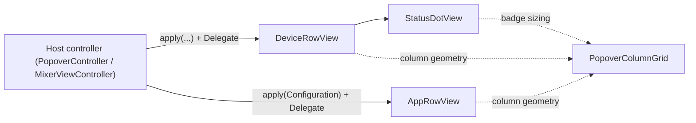

# AirPlayControllerSharedUI

## Purpose

AppKit row views SHARED by both the menu-bar **popover** (`AirPlayControllerPopoverUI`) and the full **mixer window** (`AirPlayControllerWindowUI`). This target exists so the window can link the one device-row implementation without pulling in the whole dropdown — "same row component, one test surface, identical behaviour in both hosts." Every view here is **pure UI**: controls route back through a per-view `Delegate` (or closure); no view talks to a backend, store, or `GroupController`. For the Device / backend / routing model these rows render, see [../../AGENTS.md](../../AGENTS.md).

**Keep up to date when:** a row's control set / layout column changes, `PopoverColumnGrid` constants move, the connection-status badge states change, a row's selection/removal affordances change, or a new shared row type lands here.

## Notable Patterns

- **Trailing-anchored shared grid.** All row types anchor their slider + trailing-control columns to fixed distances from the row's *trailing* edge (not leading), so columns line up across sections despite different leading controls. The name label is the flexible column that truncates. All geometry lives in `PopoverColumnGrid` — no magic numbers in the row views.
- **`apply(...)` is the only inbound seam.** Hosts push a plain-value snapshot in; the view never reads shared model state itself. `DeviceRowView` takes membership (`selected`) explicitly because it lives in `GroupController`, not on `Device`. `AppRowView` takes an isolated `Configuration` (no `AppRoute`/store dependency).
- **Sticky-hover discipline.** Transient hover is kept separate from model state, cleared on every `apply` and on re-parenting, and reconciled against the true pointer position via an app-local `.mouseMoved` monitor — an `NSTrackingArea` alone never fires `mouseExited` for a bottom-most row with an untracked dead-zone below it. `DeviceRowView` and `AppRowView` both implement this — `AppRowView` uses it to drive a NEUTRAL grey hover wash (`unemphasizedSelectedContentBackgroundColor`) kept visually distinct from its accent selection highlight.
- **Host-aware drawing (`DeviceRowView` only).** Computes `isInMenu` live from `enclosingMenuItem`: paints the system menu highlight itself in a menu, paints a rounded selection/hover pill in a menu-less host (popover card / window), and switches its accessibility role (`.menuItem` vs `.group`) to match.
- **`test_*` hooks everywhere.** Headless tests can't synthesize real drags/clicks, so each view exposes `test_setVolume`, `test_toggleEnabled`, `test_reconcileHover`, `test_statusKind`, etc. that drive the exact same delegate/state paths as the real controls.
- **On-icon status redesign (2026-07-17).** Connection status is a corner dot ON the icon (`StatusDotView`), not a right-side slot. The name is single-line and centered except in `.failed`, which adds a "Couldn't connect" sublabel. The icon is neutral (`.secondaryLabelColor`, no accent fill); clicking the name toggles the ENABLED switch.

## Architecture

## Key Types

| Type | File | Role |
|---|---|---|
| `DeviceRowView` | `DeviceRowView.swift` | The one shared device row (icon · name · mute · slider · % · ENABLED switch), hosted by BOTH popover and window. `Delegate` callbacks: `didSetVolume` / `didToggleMute` / `didToggleEnabled` (primary "send audio here" routing). `StatusKind` mirrors the on-icon dot. |
| `StatusDotView` | `StatusDotView.swift` | On-icon connection-status badge driven off `Device.connectionState`: hidden (`.off`), breathing-neutral (`.connecting`/`.reconnecting`), green (`.connected`), amber (`.failed`). Static fallback under Reduce Motion. Layer-backed, appearance-adaptive. |
| `PopoverColumnGrid` | `PopoverColumnGrid.swift` | Shared column-geometry constants (icon / slider / readout / trailing widths, gaps, trailing anchors, and badge sizing). Kept as NAMED CONSTANTS for a future compact/normal/large density setting. |
| `AppRowView` | `AppRowView.swift` | Per-app "Applications card" row (app icon · name · volume · destination popup). Popover-only. **Single-selection row:** clicking/right-clicking the row body (NOT the slider or destination popup — see `test_pointIsInSelectableDeadZone`) fires `Delegate.appRow(_:didRequestSelect:)` and takes first responder; the host pushes `isSelected` back, drawn as a translucent accent wash (`controlAccentColor` @ 18%), distinct from the neutral-grey hover. Selection is TRANSIENT: the host (`PopoverController`) resets it when the popover closes and clears it on any mouse-down outside an app row or the ± footer (deselect-on-outside-click). **Removal has three paths** — the right-click `NSMenu` ("Route to" submenu · separator · destructive "Remove from list" as the last item), `deleteForward:`/`deleteBackward:` on the focused row, and the card's ± footer — all funnel through the single `Delegate.appRow(_:didRemoveFor:)`. `Destination` / `Configuration` are plain-value inputs. |

## Consumers

- **Popover** (`AirPlayControllerPopoverUI`): `PopoverController` hosts `DeviceRowView` and `AppRowView` (the Applications-card add/remove ± is an `NSSegmentedControl` footer owned by the host — it replaced the retired `AddApplicationRowView`); its `MainOutRowView` / `GroupRowView` also lay out against `PopoverColumnGrid` so all sections' columns align.
- **Window** (`AirPlayControllerWindowUI`): `MixerViewController` hosts only `DeviceRowView` (default init — toggle shown, paints selection background) and `PopoverColumnGrid`.

## Tests

Tests live in [../../Tests/AirPlayControllerCoreTests/](../../Tests/AirPlayControllerCoreTests/).

| Test | Covers |
|---|---|
| `DeviceRowConnectionStateTests` | `DeviceRowView` status-badge state mapping, failed-only sublabel, breathing/Reduce-Motion, name-click toggle, hover reset. |
| `AppRowViewTests` | `AppRowView` destination menu sectioning, slider dim-while-local, row selection (body-click vs slider/popup dead-zone), context-menu order + destructive remove, Delete/Backspace removal, delegate paths. |

Interactive smoke via `popover-harness` / `window-harness` (`../popover-harness/`, `../window-harness/`), which exercise these rows in a live host.
