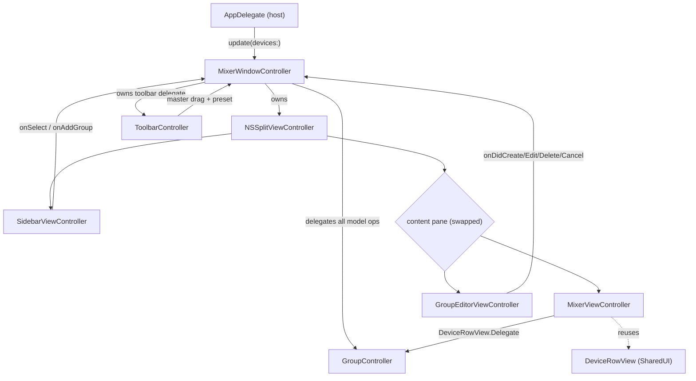

# AirPlayControllerWindowUI

## Purpose

The full mixer window UI — the richer, document-style AppKit window (SPEC §9), as
opposed to the menu-bar popover in `../AirPlayControllerPopoverUI`. This module
owns an `NSWindow` (unified toolbar + full-size content view), a source-list
sidebar of groups/devices, a mixer detail pane of device rows, and an in-window
group editor (rename / membership / delete / draft-create). All mixer math —
groups, proportional master, mute, the Selected/Enabled set — is delegated to the
shared, UI-agnostic `GroupController` documented in [../../AGENTS.md](../../AGENTS.md);
this module never computes volumes itself.

Keep up to date when: the window's split/toolbar structure changes, a new
sidebar section or detail pane is added, the sidebar→pane selection contract or a
`GroupController` call site changes, or the group-creation (draft) flow changes.

## Notable Patterns

- **`@MainActor` window controller.** `MixerWindowController` is `@MainActor`; the
  app folds backend events into a `[Device]` snapshot on the main thread before
  calling `update(devices:)`. Devices are held keyed by id and sorted by
  `(name, id)` via `orderedDevices()`.
- **Content pane is swapped, not toggled.** The content `NSSplitViewItem` is
  removed and re-added to switch between the mixer and editor panes
  (`swapContent(to:)`); `contentSplitItemRef` tracks the live item. Sidebar
  selection of a group both activates it (preset) *and* shows its editor.
- **Draft groups have no id.** While the editor shows an unsaved "New Group"
  draft (`isCreatingDraft`), `refreshAll()` deliberately leaves the editor
  untouched (no persisted id to rebuild from). Empty drafts (no checked members)
  are never saved; identical member sets dedup to an existing group on save.
- **Shared row, shared delegate shape.** The mixer pane reuses `DeviceRowView`
  from `../AirPlayControllerSharedUI` and routes its switch/slider/mute through
  the same `GroupController` calls as the popover's `PopoverController`.
- **`test_*` hooks everywhere.** A headless window gets no synthesized clicks, so
  each controller exposes `test_*` methods/props mirroring exactly what real
  actions call. `window-harness` and XCTest drive these.

## Architecture

## Feature Flow

1. `MixerWindowController.showWindow()` (or `beginNewGroup()`) refreshes all panes
   and orders the window front.
2. `update(devices:)` pushes a new snapshot → `refreshAll()` reloads the sidebar,
   the toolbar presets/master readout, and the visible detail pane in place.
3. Selecting a **group** in the sidebar activates it as the preset and swaps the
   content to `GroupEditorViewController`; selecting a **device** / nothing shows
   `MixerViewController` scoped to all devices.
4. **Create a group:** the sidebar "+" (or "New Group from Selection" with devices
   multi-selected) opens an empty/seeded draft in the editor. Save →
   `GroupController.createGroup` → the window activates + selects the resolved
   group. Cancel → pop back to the mixer.
5. **Edit:** rename (`NSTextField`, commits on Return/focus-loss) and membership
   checkboxes write through `saveGroup`; "Delete group…" (confirmation sheet)
   calls `deleteGroup` and pops back to the mixer.
6. Toolbar master-slider drags bracket through `beginMasterDrag`/`setMasterVolume`/
   `endMasterDrag`; the presets popup activates/deactivates a group.

## Key Types

| Type | Role |
|---|---|
| `MixerWindowController` | Owns the `NSWindow` + `NSSplitViewController` lifecycle; wires child controllers' callbacks to `GroupController`; the `ToolbarController.Delegate`. Public entry for app/harness. |
| `MixerViewController` | Mixer detail pane: an `NSStackView` of `DeviceRowView`s scoped to a group (or all devices); its `DeviceRowView.Delegate`. |
| `SidebarViewController` | Source-list `NSOutlineView` with "Groups"/"Devices" sections; multi-select; "+"/context-menu group creation. Reports `SidebarSelection` via `onSelect`. |
| `GroupEditorViewController` | In-window rename / membership-checkbox / delete pane; also the unsaved draft-create flow. Writes through `GroupController`. |
| `ToolbarController` | `NSToolbarDelegate` hosting the master `NSSlider` + presets `NSPopUpButton`; reports drags/selection to its `Delegate`. |
| `SidebarSelection` | Enum (`.group(id:)` / `.device(id:)`) — the sidebar→detail-pane contract. |
| `SidebarViewController.Node` | Reference-typed source-list tree node (stable identity across `NSOutlineView` reloads). |

## Tests

Tests live in `../../Tests/AirPlayControllerCoreTests/`.

| Test file | Focus |
|---|---|
| `MixerWindowControllerTests.swift` | Window chrome (`.unified` toolbar, `.fullSizeContentView`, mounted toolbar items), sidebar→pane swapping, preset activation, and the full group draft/edit/delete flow — driven through the `test_*` hooks (the window-harness path). |
