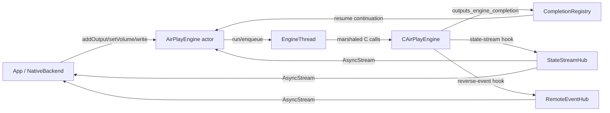

# Sources/AirPlayEngine

## Purpose

The Swift host layer of the `AirPlayEngine` package: the neutral async API
(`AirPlayEngine.swift`), the engine-thread/libevent wrapper (`EngineThread.swift`),
the C-completion-to-`async`/`await` bridge (`CompletionRegistry.swift`), and the
public value types (`AirPlayTypes.swift`). Everything the package-root
`../../AGENTS.md` describes as "the neutral Swift API" lives in this one target.

Boundary: this target calls into `Sources/CAirPlayEngine` (vendored C) but never
the reverse — no vendored C file imports Swift. It is a peer of `Sources/engine-probe`
(a CLI consumer, gated live-session tool) and `Sources/ptp-helper` (a separate
privileged daemon target); neither is built from code in this folder, and this
target never binds PTP sockets itself (see the package-root Rules for the PTP
client/binder split). See `../../docs/seam-map.md` for how the app (outside this
package) is expected to consume this API.

**Keep this file up to date** — when a new file/type/hub lands here or a
concurrency contract changes, update this AGENTS.md in the same change.

## Notable Patterns

- **Two nonisolated mirrors shadow actor state for the hot write path.**
  `AirPlayEngine.write(streams:pts:)` is `nonisolated` (must not hop the actor
  executor per audio frame), so it cannot read `started`/`headlessMode`
  directly. `startedFlag`/`headlessFlag` (`AtomicBool`, lock-guarded) are kept
  in lock-step with those actor-isolated properties by every writer. Same
  pattern for `engineThreadHolder` (`EngineThreadHolder`, `EngineThread.swift`)
  which the write path reads to get the *current* `EngineThread` without an
  actor hop — necessary because `start()` builds a **fresh** `EngineThread` per
  call (`Thread.start()` on an already-started thread aborts).
- **Per-`OutputID` op serialization.** `opsInFlight`/`opWaiters` in
  `AirPlayEngine` ensure a second `addOutput`/`removeOutput`/`setVolume` on the
  same id awaits the first rather than racing. `acquireOp` is NOT re-entrant, so
  a composite op that must be atomic across several backend calls
  (`rebindOutput` = stop + re-add) acquires the slot ITSELF and passes
  `serialize: false` down to `startOp` — there is exactly one serialization
  mechanism here, never a second one — belt-and-suspenders with
  `CompletionRegistry.arm`'s own refusal to overwrite an already-armed
  `callbackId` (`arm` returns `false` rather than clobber, see B5.3 in that
  file).
- **Exactly one of {deliver, cancel, timeout} ever resolves a waiter.**
  `CompletionRegistry.Waiter` is removed from the `waiters` table under `lock`
  before any of its three closures runs, so a continuation is resumed exactly
  once — this exists because a leaked continuation both trips "CONTINUATION
  MISUSE" and hangs `stop()`/app-quit (see the 2026-07-17 toggle-spam
  postmortem cited inline in `CompletionRegistry.swift`).
- **`knownOutputs` is reconciled asynchronously, never trusted as ground
  truth by the idempotency guards.** `AirPlayEngine.addOutput`/`removeOutput`
  read `liveDeviceState(_:)` (the live C `device->state`, on the engine thread)
  before deciding to no-op, because `knownOutputs` is folded from
  `stateHub`'s own stream (`startStateReconcile`) and can momentarily lag an
  out-of-band transition (e.g. a receiver dropping RTSP).
- **`EngineThread.enqueue`'s tracked/untracked split.** Ops that carry a
  continuation register in `pending` (swept and force-run in `stop()` so no
  continuation is stranded if the loop breaks first); the hot write path opts
  out (`tracked: false`) since dropping a late frame on teardown is correct
  and a per-write dict op would be wasted cost.
- **`EngineThread.stop()` is deadlined, not spin-forever.** A wedged vendored
  callback in a blocking syscall never returns; past `stopJoinDeadline` (3s)
  the thread/base is deliberately leaked (logged fault) rather than hanging
  the actor that owns `stop()`.

## Architecture

## Feature Flow — `start()` → session → `stop()`

1. `AirPlayEngine.start()` guards re-entrancy (`starting`/`started` set before
   any suspension point), builds a fresh `EngineThread`, and marshals the rest
   through `engineThread.run { ... }`.
2. On the engine thread: crypto init, SIGPIPE mask, libevent logging wired,
   `evbase_player` set, `outputs_dispatcher_init()`, then
   `completions.install()` / `stateHub.install()` / `remoteHub.install()`
   (must precede `airplay_init`, which spawns the events thread that fires
   `remoteHub`).
3. `applyConfigOnEngineThread()` pushes `EngineConfig` into the vendored
   `conffile` setters (retained C strings, not copied by the C side).
4. `ptpd_find_or_bind()` runs (non-fatal; result published as
   `ptpClockAvailable`), then both `output_airplay.init` and `output_raop.init`
   run so AP2 and RAOP discovery/session paths are both live.
5. `updateDiscovery(_:)` feeds a resolved `DeviceDescriptor` into the vendored
   discovery callback (`feedDescriptor`, engine thread) and seeds
   `knownOutputs[id] = .stopped`.
6. `addOutput(_:streamId:)` checks live device state (idempotency), binds
   `stream_id` if needed, then `startOp` arms a `CompletionRegistry` waiter and
   issues `device_start`, awaiting the terminal `OutputState`.
7. `write(pcm:streamId:pts:)` / `write(streams:pts:)` feed PCM on the hot,
   `nonisolated` path straight onto the engine thread — no actor hop.
8. `removeOutput`/`stop()` reverse the above: `stop()` runs
   `airplay_deinit`/`raop_deinit`/`ptpd_deinit`, uninstalls all three hooks,
   clears the C registry, and tears down `EngineThread`.

## Folder Map

This target has no subfolders — all four files sit directly in
`Sources/AirPlayEngine/`. `Sources/CAirPlayEngine/`, `Sources/engine-probe/`,
and `Sources/ptp-helper/` are sibling targets documented in the package-root
`../../AGENTS.md`.

## Key Types

| Type | File | Role |
|---|---|---|
| `AirPlayEngine` (actor) | AirPlayEngine.swift | Public session API: lifecycle, discovery feed, add/remove/volume, PCM write, state/remote streams. |
| `EngineConfig` | AirPlayEngine.swift | Config applied to `conffile` at `start()`; owns `startBufferMs`/`presentationDelayMs` derivation. |
| `OutputBindResult` | AirPlayEngine.swift | `addOutput(_:streamId:)`'s outcome: `.bound` vs `.alreadyBound(streamId:)` — makes the already-live idempotent no-op visible to the caller instead of silent (architecture review 2026-07-26, defect B). |
| `EngineThread` | EngineThread.swift | Owns the one `event_base` + OS thread; sole path (`run`/`enqueue`) onto the vendored cluster. |
| `EngineThreadHolder` | EngineThread.swift | Nonisolated, lock-guarded slot holding the *current* `EngineThread` (swapped per `start()`). |
| `CompletionRegistry` | CompletionRegistry.swift | Bridges the C `outputs_engine_completion` callback to `async`/`await`, one-shot per `callbackId`, with a 12s timeout backstop. |
| `StateStreamHub` | AirPlayEngine.swift (~1369) | Multicasts `(OutputID, OutputState)` transitions; feeds both `knownOutputs` reconcile and external subscribers. |
| `RemoteEventHub` | AirPlayEngine.swift (~1435) | Multicasts `RemoteEvent` (speaker-originated transport/volume) from the vendored reverse-event thread. |
| `WriteCadenceTracker` / `WriteLatencyProbe` | AirPlayEngine.swift (~1537, ~1671) | Diagnostic-only hot-path instrumentation; never gate a write. |
| `OutputID`, `DeviceDescriptor`, `OutputState`, `RemoteEvent`, `AirPlayEngineError`, `PCMFormat` | AirPlayTypes.swift | Public, OwnTone-free value types at the FFI boundary. |

## External Dependencies

| Dependency | Used for |
|---|---|
| `CAirPlayEngine` (sibling C target) | All vendored AirPlay 2/RAOP sender + PTP-client calls; imported by all four files here. |
| `os` (Logger) | Structured logging (`ptp-clock`, `completion`, `engine-thread` subsystems/categories). |
| Foundation (`Thread`, `DispatchSource`, `NSLock`) | `EngineThread`'s OS thread + timers; `CompletionRegistry`'s lock and timeout timers. |

## Tests

No test files live under this directory; per the package layout, tests for
this target are under `AirPlayEngine/Tests/` (see package-root AGENTS.md /
README for the suite). `AirPlayEngine.issueOverride` and
`CompletionRegistry.deliverForTest`/`hasWaiter` are headless test seams
defined in this target specifically so those tests can exercise the real
completion path without a live receiver.
