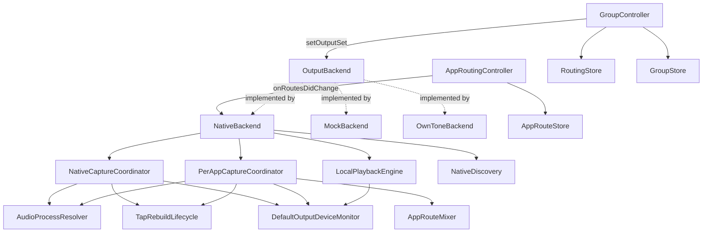

# AGENTS.md history: AudioutCore/Sources/AudioutCore

Archived verbatim from AGENTS.md on 2026-09-02 when that file was trimmed to the root rule (three sections, at most 300 words). Not maintained: symbols named below may no longer exist. Orientation lives in AGENTS.md; grep this file for the long form of a trap, the dated decisions, and the changelog.

---

# AudioutCore/Sources/AudioutCore

## Purpose

This is the actual source folder for the `AudioutCore` library target — the
UI-agnostic routing/session core: device discovery, output backends, capture
(whole-system + per-app), the routing "brain" (Selected Devices/Main Out/
scenes/per-app redirects), local playback, persistence, and the first-run
setup/permissions flow. It owns everything up to the `OutputBackend` protocol
seam; it never imports AppKit and knows nothing about windows, popovers, or
views (those live in `AudioutSharedUI`/UI targets, one level up). The
package-level [../AGENTS.md](../AGENTS.md) carries the full behavioral
Rules list and Map for this folder plus the surrounding package (UI targets,
test conventions, pre-commit gate) — read it first; this file is a narrower
map of just this folder's types and their wiring, kept for faster navigation
when a task is scoped to core logic only.

**Keep this file up to date** when: a new top-level coordinator/controller is
added or removed, the routing/capture data flow changes (a new hop is added
or an existing one is rewired), a type moves in/out of this folder, or a
external (non-Apple) dependency is added/dropped.

## Notable Patterns

See [../AGENTS.md](../AGENTS.md) Rules for the authoritative, line-by-line
invariants (redirect routing path, metering sources, volume-seed race,
`Device.isSelected` vs. `GroupController.isSpeakerSelected`, multi-process
bundle-ID resolution, `.currentDevice` anti-feedback guard, etc.) — those
apply directly to the files in this folder and are not restated here to
avoid drift between two copies.

`SyncCore.swift` (`SyncTiming`, `FractionalResampler`, `PhaseController`) is
deliberately LICENSE-CLEAN — it carries no GPL SPDX header, unlike every
sibling, so the upcoming Apple-only Bluetooth sink can share its timing/drift
math (PLAN-UNIVERSAL-SYNC Decision 5). Never add the GPL header to it and
never move GPL-derived code into it.

**A trim change — or a measured LATENCY change — must NEVER rebuild a sink** —
Bluetooth or the Mac's own. Latency and trim are the same linear term in the
delay (`reference − latency + trim`, roadmap 056 Part A), so
`BTSyncedSink.setOffsetMs(_:forDeviceUID:)` lands live through the same splice
`setTrimMs` uses; the alignment wizard pushes one per trial, and a rebuild each
time would drop the speaker into silence with nothing left to judge. The
delay is physically the audio piled up in the sink's ring when the release gate
opened, so a trim is a move of the read position — `BTDeviceSink.applyTrimDelta(ms:)`,
spliced with an equal-power crossfade (and FLOORED in the forward direction:
a seek that reaches the write pointer leaves the ring dry for good, so it stops
`seekSafetyMarginMs` short and logs `bt_sink_seek_clamped`), and
`SyncedLocalSink.applyUserOffsetDelta(ms:)`,
whose splice is a plain (uncrossfaded) seek — not a new session. Rebuilding stops
and restarts the engine and re-holds silence for the whole delay, which a live
scrub (or a wizard trial run against the Mac) would turn into permanent silence.
Both are pre-release/post-release pairs: before the gate opens there is nothing
to be continuous with, so the TARGET moves instead of the audio. The seek must
also never run `clearSessionStateLocked`/`clearSessionState`: a seek is not a new
session, and wiping it would throw away the anchor and the ring's contents. A
rebuild (`requestRebuild`/`requestReanchor`) is for genuine structural changes
only (`config_change`, `rate_change`, `composition_change`, `wizard_feed`) — plus
the local sink's one fallback, a trim bigger than its ring can replay, which is
the only surviving `offset_change`. Moving the BT-only REFERENCE timeline
(`BTSyncedSink.setBTOnlyBufferMs(_:)`, which `NativeBackend` raises past the
slowest measured latency and, for the duration of a Bluetooth wizard run, to
`btWizardReferenceBufferMs`) IS structural, and deliberately reuses
`composition_change` rather than adding a rebuild kind — the reference moving is
exactly what that cause means.

**A flat EQ must stay byte-identical passthrough — never route a flat buffer
through `EQProcessor`.** Widening to float and requantizing is not bit-exact, so
"EQ off" only stays honest if the processor is bypassed outright. Two siblings of
that rule: `DeviceEQ.swift`/`EQProcessor.swift` are LICENSE-CLEAN (no GPL header)
so the Bluetooth sink can run the same processor — never add one or move
GPL-derived code in; and `DeviceEQStore` drops flat entries on save, so a
round-trip legitimately returns fewer keys than it was handed.

**SUPERSEDED 2026-09-15 (roadmap 056): there is no EQ rebind any more.** Every
speaker owns a whole-system stream from connect to disconnect
(`connectTargetStreamLocked`) and an edit only retargets that stream's
processor; `EQStreamTopology`, `EQStreamAllocator` and `enqueueEQRebindLocked`
are deleted. What follows is why the old shape existed.

**An EQ rebind is a whole-system engine op: it rides the per-device `converging`
slot, and its stream ids live in their own namespace.** Moving a device onto its
EQ group's stream is a real `removeOutput`→`addOutput` with the accepted ~1 s
audible gap, so `NativeBackend.enqueueEQRebindLocked` claims `converging` (and
records the hold in `rebindConverging`, so the sleep path can release it) exactly
as `resetAirPlaySessionForWholeSystem` does, and goes through `bindOutput` — the
one call site that arbitrates on the engine's own answer — never a naked
`engine.rebindOutput`. A device already `converging` is skipped, not queued: the
running loop settles it on stream 0 and the next reconcile moves it again.
`EQStreamAllocator` allocates from `0x8000_0000` upward while `AppRouteMixer`
allocates from 1, so the two id spaces can never collide and the EQ budget can
count per-app streams by range test alone.

**`reconcileEQPlan` owns BOTH `added` edges, and `pushEQPlanLocked` NEVER
rebuilds a live stage.** (The stream-move half is superseded — see above; the
processor-reuse half below is still the rule.) The departure edge is
`removeFromAddedLocked` — the
single site every per-device `added.remove` goes through — because a departure
frees a stream for whoever the budget refused AND takes the departed device's
stream out of the plan; `setOutputSet`'s reconcile cannot cover it (it runs while
the teardown is still in flight, device still in `added`). The two
`applyEngineState` arms are the exception: they hold an uncommitted `Device` copy
that would clobber the reconcile's `eqBypassReason` writes, so they set
`eqNeedsReconcile` and reconcile AFTER the commit. On the plan side, an unchanged
stage is carried over instance-and-all (`EQProcessorSlot`) and the EDITED stage
is `retarget`ed in place: a new `EQProcessor` starts with zeroed IIR delay
memory, which is a tick on a neighbour and — republished per drag frame — a
crackle running the whole length of the scrub on the speaker being edited.
`retarget` builds the coefficients on `stateQueue` and posts them to the
processor's one-slot mailbox; the DELIVERY thread picks them up under an
`NSLock.try()` (the `handleBuffer` idiom), carries the surviving sections' delay
pairs across, and parks the displaced engine for the next `retarget` to free —
so the audio thread never allocates, frees or blocks. Never read a live
processor's filter state from `stateQueue`: it may be mid-`process()`. An
uncommitted edit on a device with no entry in `eqStreamIDByDevice` publishes
nothing at all.

**A device the per-app domain claims is EXCLUDED from the EQ domain, and must say
so with its own reason.** Its audio comes from `AppRouteMixer`, never through the
whole-system EQ stage, so `reconcileEQPlan` sets `eqBypassReason =
.perAppRouting` for a claimed device with a non-flat stored EQ — a different
sentence from `.streamBudget`, because sending the user to delete other speakers'
tone would not help. The Equalizer page (Scenes screen)
carries the honesty — the popover shows no tone state at all.

**A Bluetooth trim change must NEVER rebuild a sink.** The delay is physically
the audio piled up in `BTDelayLine`'s ring when the release gate opened, so a
trim is a move of the read position — `applyTrimDelta(ms:)`, spliced with an
equal-power crossfade — not a new session. Rebuilding stops and restarts the
engine and re-holds silence for the whole delay, which the drawer's live scrub
would turn into permanent silence. The seek must also never run
`clearSessionStateLocked`: a seek is not a new clock context, and wiping the
drift `PhaseController` would throw away its learned rate. `requestRebuild` is
for genuine structural changes only (`config_change`, `rate_change`,
`offset_change`, `composition_change`).

**A Bluetooth EQ change is a property swap too — never a rebuild.** Same reason
as the trim: a rebuild re-arms the release gate and the device goes silent for
the whole reference delay, which would make a tone scrub unusable.
`BTDeviceSink.setEQ` bakes a NEW `EQProcessor` on `graphQueue` (never on the
render thread, and never by re-parameterizing a live one — its biquad state
belongs to the render thread alone) and publishes it under the same `stateLock`
snapshot the render gate reads; the render block applies it to the frames it just
produced. The manager remembers the value per UID like the gain, so a sink
created later starts already shaped, and `startLocked` re-derives from that
remembered value after a genuine rebuild.

**PTP activation and helper lifecycle:**
The app's PTP activation wait (`ptpActivationTimeout`, 14s) must STRICTLY EXCEED the helper's bind-retry budget (10s) — an equal wait can never observe a late success. The helper self-exits after ~15s idle and unlinks its shared clock record, so any connect-time wait must keep re-demand-starting it (the activator re-touches every 2s); a single pre-wait touch is a proven failure mode.

**"Taking audio back from macOS…" strip trigger:**
The strip is triggered by the helper's clock not being ready — NOT by a macOS AirPlay session. The switch-away step is a no-op whenever the Mac's output isn't an AirPlay receiver.

**Helper-cycling self-heal path:**
Helper-cycling must ALWAYS go through `PTPHelperReconciler.unregisterDrainAndReregister` — never re-derive the unregister→register sequence. A register() call before the drain completes is a proven failure mode producing a doomed registration.

**The first-run `register()` throw is not a failure (2026-09-07):**
On current macOS the FIRST `SMAppService.register()` for a daemon normally THROWS (`SMAppServiceErrorDomain` code 1, "Operation not permitted") while the "Background Items Added" notice is shown, and `status` afterwards reads `.requiresApproval` — the user finishes it in Login Items. `SetupModel.registerPTPHelper()` used to take ANY throw as a packaging fault (sticky `ptpHelperRegistrationFailed`), which auto-passed the onboarding step on every first run and left the helper unregistered. The status AFTER the throw decides now: only `.notFound` is the fault. Approval alone does not load the daemon either — the next `register()` after it does — so the Setup window registers again on every return to the front (`SetupModel.reregisterPTPHelperOnReturn()`), never from the status poll, and a once-approved helper that reads `.notFound` (BTM reset) gets one drain-safe recycle through the reconciler.

**The decision log stopped going to PostHog (2026-09-10):**
1.1.1 shipped `54cdfea8`, which forwarded every `Telemetry.log` line to PostHog
Logs under the usage-stats opt-in and stripped only six field names (`device`,
`deviceID`, `uid`, `name`, `host`, `address`). A denylist was the wrong shape:
live records carried app bundle ids (`org.mozilla.firefox`,
`com.spotify.client`), speaker names rendered by
`NativeBackend.telemetryDeviceList`, and raw error strings such as
`processNotYetAudible(bundleID:)` — all of it forbidden by PRODUCT.md "Data
Collection". The owner deleted the forward rather than lengthen the strip list.
The rule is an allowlist now, with one implementation:
`Telemetry.fail(category, event, local:, shared:)` writes both field sets to the
local file at `level:error` and sends only `shared` to
`Analytics.captureError`. Ordinary `Telemetry.log` lines never leave the Mac;
the user ships them by hand through Settings › About › Save diagnostics. Never
put a forward back into the private `write(...)` helper that `log` and `fail`
share — that is precisely how `local:` fields would start leaking again.

TRAP: an error report from `fail` has no usable stack trace. The send runs on
the telemetry writer's queue, so the trace the PostHog SDK builds describes that
queue and never the code that failed. The exception type (the event name) is the
only locator; the detail is in the local `telemetry.jsonl` line.

TRAP: `scripts/run-tests.sh` exited 1 after fully green runs, because its EXIT
trap killed an already-finished process group with a bare `kill` and `set -e`
lets a command failing inside an EXIT trap replace the script's exit status.
Guard 4 read those green suites as failures. Fixed by adding `|| true` to the
kill.

Four documents state what leaves the Mac, and a change to any one of them moves
all four: `PRODUCT.md` "Data Collection", `UsageStatsConsentCard.bodyText`, the
website's privacy page and its support page about usage statistics, and
`audiout-shared/docs/analytics-events.md`.

## Architecture

`DefaultOutputDeviceMonitor` is the single process-wide owner of the shared
default output device's identity and nominal sample rate: one HAL listener
pair, fanned out to subscribers (both capture coordinators and
`LocalPlaybackEngine`), watcher-only (never writes device config).
A nominal-rate reading at or below 16 kHz on the device it last delivered at a
higher rate is a Bluetooth headset entering hands-free mode: the monitor
withholds it for its settle window instead of delivering it on the leading
edge, which collapses a connect burst's four tap rebuilds to one. A reading
that outlasts the window is delivered on the trailing edge. TRAP: a reading
that RETURNS above 16 kHz inside the window is delivered FORCED, past the
per-subscriber divergence check — the withheld reading was never tracked, so
the return diverges from nothing, while the transition that opened the window
has already silenced every tap. A device-identity change or any rate above
16 kHz still delivers at once.
`TapRebuildLifecycle.swift` holds the two pieces of the two coordinators'
tap-rebuild machinery that are genuinely identical (`TapRebuildCoalescer`,
`TapReanchor`); the claim/teardown/commit choreography itself is still two
separate bodies, one per coordinator, by deliberate design (see
`docs/notes/architecture-review-audio-routing-2026-07-26.md`,
"Correction" section, defect A).

`GroupController` and `AppRoutingController` are the two routing-decision
owners; both talk to whichever `OutputBackend` is active only through the
protocol, never a concrete type. `NativeBackend` is the shipping
implementation and is the only one that wires up real Core Audio capture
(`NativeCaptureCoordinator`, `PerAppCaptureCoordinator`) and local playback
(`LocalPlaybackEngine`).

## Feature Flow

Selecting a device as a Main Out / Selected Device target:
1. UI calls into `GroupController`, which updates `selectedDeviceIDs`/
   `mainOutMemberIDs` and persists via `RoutingStore`/`GroupStore`.
2. `GroupController.applyRouting` computes the live output set (Selected
   Devices minus the local Mac) and calls `OutputBackend.setOutputSet`.
3. `NativeBackend` reconciles: opens/closes AirPlay sessions per device and
   gates `NativeCaptureCoordinator`'s whole-system tap off `expectedSelected`.
4. Device state changes (connect/fail/level/volume) flow back as
   `BackendEvent`s that `GroupController`/UI observe.

Redirecting one app to a specific device:
1. UI calls into `AppRoutingController`, which updates the app's
   `AppRouteDestination` and persists via `AppRouteStore`.
2. `AppRoutingController.onRoutesDidChange` fires; the app wires this to
   `NativeBackend.updateAppRoutes(_:excludedBundleIDs:)` (`AppRouteConfiguring`).
3. `PerAppCaptureCoordinator` starts a tap for the app's full process set
   (`AudioProcessResolver`); `AppRouteMixer` mixes per-app streams into a
   per-destination stream and applies per-app volume.
4. The redirected app's audio never joins `setOutputSet`'s whole-system mix.

## Key Types

| Area | Types |
|---|---|
| Domain models | `Device`, `ConnectionState`, `ConnectionFailure`, `BackendEvent` |
| Backend seam | `OutputBackend`, `NativeBackend`, `MockBackend`, `OwnToneBackend`, `makeBackend(_:)` |
| Whole-system capture | `CaptureCoordinator`, `NativeCaptureCoordinator`, `AudioProcessResolver` |
| Per-app capture/mix | `PerAppCaptureCoordinator`, `AppRouteMixer`, `LeveledAppInjector` |
| Shared capture infra | `DefaultOutputDeviceMonitor`, `TapRebuildLifecycle` (`TapRebuildCoalescer`, `TapReanchor`) |
| Routing brain | `GroupController`, `AppRoutingController`, `PhaseController` |
| Repaint gating | `StructuralStateGate` — has selection/scenes moved since the surfaces were last painted? `onStateDidChange` fires for EVERY model change (a volume-key hold included) while the repaints it can trigger are full sweeps, so the coordinator gates them on this. |
| Persistence | `AppRouteStore`, `RoutingStore`, `GroupStore`, `AppSettings`, `ExcludedAppsStore`, `ExcludedAppsController`, `DeviceIconStore`, `DeviceEQStore` |
| Tone shaping | `DeviceEQ`, `EQProcessor` |
| Mic-probe calibration (064) | `MicProbeSession`, `BuiltInMicRecorder`, `MicCapturePermission` (license-clean; hardware-free). The DSP itself — `SyncProbe`, `SyncProbeCorrelator` — moved out to the `ProbeKit` package in [audiout-shared](https://github.com/aa-hh/audiout-shared), which the iPhone companion also links |
| Local playback | `LocalPlaybackEngine`, `SyncedLocalSink`, `LocalOutputLatency`, `DefaultOutputObserver`, `SystemOutputVolume` |
| Public aggregate device (Wave 3) | `AggregateOutputDevice` — PUBLIC aggregate "Audiout" (UID `com.audiout.Audiout.aggregate`); wired by `NativeBackend` (adopt/sweep/restore on start/quit). Becomes Mac default when whole-system routing arms; restore-prior-default-then-destroy on quit. New `BackendEvent` case `routingBlockedNeedsDefault(Bool)` (in `OutputBackend.swift`) drives popover warning via `PopoverController.setRoutingBlockedNeedsDefault(_:)` and user-reselect via `PopoverController.onReselectAudiout`. Shared `EffectiveCaptureDevice.resolve(_:)` (in `NativeCaptureCoordinator.swift`) prevents the private tap-aggregate nesting on the public aggregate (A1). **Interim ceiling:** system volume slider + hardware volume keys dead (A2); fix is `docs/plans/PLAN-VOLUME-KEY-INTERCEPTION.md`. **Seamless handoff (Wave 3 T9+):** `AirPlayHandoffWatcher` (best-effort unified-log watcher for blocked macOS AirPlay attempts; spawns `/usr/bin/log stream`; degrades silently), `BlockedAirPlayAttempt` (pure matcher), `PTPHelperReleasing` (fast ~1s port release), `releaseForHandoff`/`resumeFromHandoffLocked` (NativeBackend seam; release preserves selection intent, resume restores whole-system + per-app). |
| Cast output | `CastOutputManager`, `CastDeviceEnumerator`, `CastRoomDelay`, `PCMDelayLine` |
| Discovery/diagnostics | `NativeDiscovery`, `ConnectionDiagnostics`, `Telemetry`, `AudioDiag` |
| Setup/permissions | `SetupModel`, `AudioCapturePermissionProbe`, `LocalNetworkPrimer`, `RemoteControlPrimer`, `PTPHelperService`, `SystemAudioCaptureTCC` |
| Misc infra | `DACPServer`, `FIFOManager`, `AppRelaunchCommand`, `HeadlessRuntime`, `ObjCExceptionCatching` |

## External Dependencies

| Dependency | Usage |
|---|---|
| `AirPlayEngine` | Vendored/local package driving the native AirPlay 2 protocol; `NativeBackend` and `LocalPlaybackEngine` are its main callers here. |
| `ProbeKit` | Remote package (MIT), from [audiout-shared](https://github.com/aa-hh/audiout-shared), pinned by version: the sync-probe sweep synthesis and matched filter. `MicProbeSession` and `AlignmentTickInjector` are its callers here. Changing it means a release there and a pin bump here — it is not editable from this repo. |
| `PTPHelperService` / `SMAppServicePTPHelper` | Talks to the privileged PTP helper daemon (see [PTPHelperService.swift](PTPHelperService.swift)). |
| `CastSender` | Local target: clean-room Cast v2 protocol; `CastOutputManager`/`CastDeviceEnumerator` are its callers. |

## Tests

Test files live in [../../Tests/AudioutCoreTests](../../Tests/AudioutCoreTests)
(57 files, one suite roughly per type above). Two conventions apply
repo-wide and are detailed in [../AGENTS.md](../AGENTS.md): subclass
`IsolatedTestCase` instead of touching `UserDefaults.standard`/shared temp
dirs directly, and use `Telemetry._installTestSink(_:)` to assert a
subsystem's own emissions rather than adding ad hoc logging hooks.

2026-10-04, AirPlay passwords: a stored password the receiver refuses is deleted at the failure site (the connect catch and both state-stream failure arms in `NativeBackend`) and never retried, so a wrong password costs one attempt, not one per reconnect. On AirPlay 2 a refused password and a network failure during connect both arrive as a plain failure, so a speaker that advertises a password reads any connect failure as a bad password until the engine can say more. `notePasswordOutcome`, reading `pendingPasswordOutcome`, is the one place `airplay:code_submitted` fires, for submissions from the Mac and the phone alike.

2026-10-04, AirPlay passwords, review round 1 (supersedes the deletion rule above): a stored password is deleted only when the engine reports `.passwordRequired`, at the connect catch or a state-stream failure arm. A plain `sessionFailed` on a `.password` or `.homeMembersOnly` speaker is still read as that demand, so the user gets the prompt or the Home-app instruction, but the password is kept, because a Wi-Fi blip looks the same; every other connect error is `.unknown`. A password or code demand with no password fed leaves the speaker available, so it keeps offering "Enter password"; only a refused password makes it unavailable (owner's ruling). A password submitted while a connect is still failing buys one more attempt (`passwordResubmitted`) instead of parking, so the typed password reaches the receiver. Keychain reads happen on the caller's thread before `stateQueue`, because a read can wait on an access prompt.

2026-10-04, AirPlay passwords, review round 2: the real engine reports a failed `addOutput` on the state stream too (shims/outputs.c fires the completion hook, then the state hook), so the one-extra-attempt rule now lives in both state-stream failure arms as well as the connect catch. `passwordResubmitted` holds the typed password; while it differs from the fed password a failure report neither parks the speaker, nor shows `.failed`, nor records a password outcome, and the catch lifts any park before looping. `descriptorToFeed` clears it on every attempt, so a submit buys at most one extra attempt; Forget clears it too. The arms share their deletion and availability rule through `applyPasswordFailureLocked`.

2026-10-04, AirPlay passwords, review round 2 ruling: the `passwordResubmitted` skip applies only while a whole-system connect holds the speaker's `converging` slot (not a rebind recovery's `rebindConverging` one), because only that connect has a catch to give the typed password its extra attempt. Outside one, the mark is dropped and the failure is parked, shown and reported as before (coordinator's ruling).

2026-10-04, AirPlay passwords, review round 3: the engine fires the completion hook before the state hook, so the converge catch can loop past a failed add before its state-stream report arrives, by which time `descriptorToFeed` has spent the typed-password mark. For a `sessionFailed` or `passwordRequired` add (both always reported on the stream; a timeout or a stopped engine is not) whose report has not landed (`failureEchoSeen`), the catch records `expectStaleFailure` and the failure arm drops exactly that one report. `descriptorToFeed` clears the mark only when it equals the password it read, so a password typed between the read and the feed keeps its extra attempt. A failure report that skips for a typed password no longer marks the row unavailable or deselected.

2026-10-04, AirPlay passwords, review round 4: the converge catch now spends the typed-password mark when it grants the extra attempt, so a store that never holds the typed password (a refused Keychain write) costs one extra attempt, not an endless addOutput loop. `submitAirPlayPassword` sets the mark under `stateQueue.sync` before the store write, so a `.passwordRequired` catch in that gap loops instead of deleting the password just typed. The state-stream failure arm deletes a refused password off `stateQueue`. The `.startup` arm no longer touches the stale-echo flags: no add resolves `.startup`, and the senders report it on the state stream only from a probe.

2026-10-04, AirPlay passwords, correction to the round 4 line above: the refused-password delete in `applyPasswordFailureLocked` stayed synchronous on `stateQueue` after all. Deletes are exempt from the off-queue Keychain rule because they target an item this app's own signature created (no access prompt on a Developer ID build), and running them synchronously is what stops a background delete from erasing a password the user types right after.

2026-10-04, AirPlay passwords, the Keychain rule: Keychain reads and writes happen off `stateQueue`, because an access prompt would freeze every main-thread `stateQueue.sync`. Deletes of our own items stay on it: they never prompt on a Developer ID build.

2026-10-04, AirPlay passwords, review round 5 (coordinator's ruling): `submitAirPlayPassword` no longer waits on `stateQueue` from the main thread. It sets the mark on `stateQueue`, writes the Keychain from a background queue, then calls its completion on main, where `GroupController` runs `retryConnection` (select fallback kept). A `.passwordRequired` catch queued ahead of the mark runs while the store still holds the old password, so its delete cannot remove the typed one. The catch now moves the typed password from the mark into `passwordForNextFeed`, and `descriptorToFeed` feeds that first, then the mark, then the store, so the extra attempt carries the typed password even when the Keychain write has not landed. A feed that carries the mark's password clears it.

2026-10-04, AirPlay passwords, per-app routes: a speaker waiting for a password or code (`.failed` with `.authRequired` or `.codeRequired`, still available so it offers "Enter password") counts as unreachable for a per-app route, so the route is removed and the app rejoins the system mix; its `.connected` edge puts the route back. The route removal keeps that `.failed` (`droppedByOwnFailureLocked`), because an `.off` there would make the speaker reachable again and re-bind into the same refusal. `handleBindFailure` maps engine errors the way the whole-system connect catch does, since the engine reports the password demand before the bind throws and a `.unknown` from the throw would overwrite it.
2026-10-04, AirPlay passwords, review follow-ups: Keychain writes from submitAirPlayPassword run on one private serial queue so two submits land in submit order; deletes are unchanged (synchronous on stateQueue at the refusal sites, caller's thread in forgetAirPlayPassword, which AGENTS-HISTORY's Keychain-rule line above overstates). A per-app route the USER removes from a speaker waiting for a password or code writes .off from updateAppRoutes, where the user's table changes; the self-drop in handleDestinationSetsChanged still keeps .failed, so the route cannot rebind into the same refusal.
2026-10-04, AirPlay passwords, AirPlay 1 plain failure: a plain sessionFailed on a .raop password speaker reads .unknown, not .authRequired (narrows the round-1 line above to AirPlay 2). The RAOP sender reports a wrong or missing password itself (RAOP_STATE_PASSWORD → .passwordRequired), so its plain failure carries no password evidence; live 2026-10-04 a stuck shairport-sync holding an old session was shown as "That password didn't work" and the speaker could not be selected. The rule lives in accessCause, which takes the fed descriptor's kind from lastDescriptors; AirPlay 2 keeps the guess because its refusal only ever arrives as a plain failure.
2026-10-04, AirPlay passwords, fixes after merge: a password demand on a Home-only receiver reads `.homeMembersOnly` (no password satisfies a Mac in Current User mode). `GroupController.submitAirPlayPassword` retries through `retryConnection` only for a selected or active-group speaker; any other speaker goes through `requestReconnect`, and `NativeBackend.retryOutput` re-drives a per-app route target waiting for a password by feeding the typed password, then writing `.connecting` so the route replays, never touching the whole-system set.
2026-10-04, AirPlay passwords, per-app retype after a refusal: a refused typed password on a per-app-only route target leaves the row unavailable (`applyPasswordFailureLocked` keeps `isAvailable` false once a password was fed), so `retryOutput`'s per-app arm writes `.connecting` with `makingAvailable: true` in one commit; without it eligibility stays false on both sides of the write, no route replay runs, nothing binds, and the row sits in `.connecting` until discovery re-announces the speaker.
2026-10-04, AirPlay passwords, password wait is a state: a password demand (`.authRequired`) with no password fed writes `ConnectionState.awaitingPassword` instead of `.failed` at all four refusal sites (the converge catch, both state-stream arms, `handleBindFailure`), with no `Telemetry.fail` and no `notePasswordOutcome`; `awaitsPassword` is the predicate, and a code demand stays `.failed(.codeRequired)`. The speaker is parked like a failure (the converge catch and the whole-system arm add it to `failedGate` and clear `isSelected`; it stays available), and `retryOutput` or a submitted password lifts it through `.connecting`; a `.stopped` report leaves it alone like a sticky `.failed`. `waitsForPasswordEntry` covers it, so a per-app route to it reads unreachable and keeps it through the unbind. `reconcileSilenceWatchdog` leaves a speaker in `.awaitingPassword` or `.failed(.authRequired)` out of `desiredNonLocal`, so neither arms the countdown; the watchdog pause the password sheet used to drive is gone. `retryOutput`'s per-app password arm requires `lastDescriptors`, so a retype never makes an offline speaker available.

2026-10-04: Forget (`SpeakerLibraryController.forget`) is the only path that removes a speaker's metadata and scene membership together; it refuses to empty a scene and never touches routing.

2026-10-06, AirPlay passwords, the Mac keeps playing: the capture gate's `want` and the silence watchdog's `desiredNonLocal` share one filter, `selectedSpeakerWantsStreamLocked`, that leaves out a speaker in `.awaitingPassword` or `.failed(.authRequired)`, and every `setConnectionState` and the engine state-stream path re-run the gate, so a lone password-waiting speaker leaves the Mac playing with no banner and no countdown (owner ruling 2026-10-06, "the Mac keeps playing"); the early return that kept an already-fired fallback on is gone. A mixed selection with a connected member is unchanged.

2026-10-06, AirPlay passwords, typed password under a group: `GroupController.submitAirPlayPassword` branches on `isMainOutMember` alone, so a speaker remembered in `selectedDeviceIDs` but absent from the active group's Main Out goes through `requestReconnect(for:)` and its typed password reaches the backend; `retryConnection(for:)`'s Selected-Devices arm returns `.ok` without calling the backend under a group.

2026-10-06, AirPlay passwords, per-app retype: `retryOutput`'s per-app password arm writes `.off` with `makingAvailable: true` after feeding the typed password and lets the replayed route's bind write `.connecting`; a throwing `updateDiscovery` logs `airplay:connect_failed` through `Telemetry.fail` and writes `.failed(.unknown)` to the row instead of returning silently.
