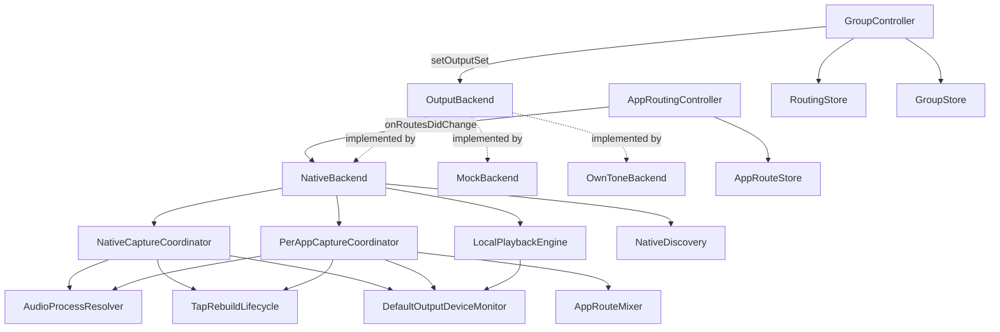

# AudioutCore/Sources/AudioutCore

## Purpose

This is the actual source folder for the `AudioutCore` library target — the
UI-agnostic routing/session core: device discovery, output backends, capture
(whole-system + per-app), the routing "brain" (Selected Devices/Main Out/
groups/per-app redirects), local playback, persistence, and the first-run
setup/permissions flow. It owns everything up to the `OutputBackend` protocol
seam; it never imports AppKit and knows nothing about windows, popovers, or
views (those live in `AudioutSharedUI`/UI targets, one level up). The
package-level [../AGENTS.md](../AGENTS.md) carries the full behavioral
Rules list and Map for this folder plus the surrounding package (UI targets,
test conventions, pre-commit gate) — read it first; this file is a narrower
map of just this folder's types and their wiring, kept for faster navigation
when a task is scoped to core logic only.

**Keep this file up to date** when: a new top-level coordinator/controller is
added or removed, the routing/capture data flow changes (a new hop is added
or an existing one is rewired), a type moves in/out of this folder, or a
external (non-Apple) dependency is added/dropped.

## Notable Patterns

See [../AGENTS.md](../AGENTS.md) Rules for the authoritative, line-by-line
invariants (redirect routing path, metering sources, volume-seed race,
`Device.isSelected` vs. `GroupController.isSpeakerSelected`, multi-process
bundle-ID resolution, `.currentDevice` anti-feedback guard, etc.) — those
apply directly to the files in this folder and are not restated here to
avoid drift between two copies.

`SyncCore.swift` (`SyncTiming`, `FractionalResampler`, `PhaseController`) is
deliberately LICENSE-CLEAN — it carries no GPL SPDX header, unlike every
sibling, so the upcoming Apple-only Bluetooth sink can share its timing/drift
math (PLAN-UNIVERSAL-SYNC Decision 5). Never add the GPL header to it and
never move GPL-derived code into it.

**A trim change — or a measured LATENCY change — must NEVER rebuild a sink** —
Bluetooth or the Mac's own. Latency and trim are the same linear term in the
delay (`reference − latency + trim`, roadmap 056 Part A), so
`BTSyncedSink.setOffsetMs(_:forDeviceUID:)` lands live through the same splice
`setTrimMs` uses; the alignment wizard pushes one per trial, and a rebuild each
time would drop the speaker into silence with nothing left to judge. The
delay is physically the audio piled up in the sink's ring when the release gate
opened, so a trim is a move of the read position — `BTDeviceSink.applyTrimDelta(ms:)`,
spliced with an equal-power crossfade (and FLOORED in the forward direction:
a seek that reaches the write pointer leaves the ring dry for good, so it stops
`seekSafetyMarginMs` short and logs `bt_sink_seek_clamped`), and
`SyncedLocalSink.applyUserOffsetDelta(ms:)`,
whose splice is a plain (uncrossfaded) seek — not a new session. Rebuilding stops
and restarts the engine and re-holds silence for the whole delay, which a live
scrub (or a wizard trial run against the Mac) would turn into permanent silence.
Both are pre-release/post-release pairs: before the gate opens there is nothing
to be continuous with, so the TARGET moves instead of the audio. The seek must
also never run `clearSessionStateLocked`/`clearSessionState`: a seek is not a new
session, and wiping it would throw away the anchor and the ring's contents. A
rebuild (`requestRebuild`/`requestReanchor`) is for genuine structural changes
only (`config_change`, `rate_change`, `composition_change`, `wizard_feed`) — plus
the local sink's one fallback, a trim bigger than its ring can replay, which is
the only surviving `offset_change`. Moving the BT-only REFERENCE timeline
(`BTSyncedSink.setBTOnlyBufferMs(_:)`, which `NativeBackend` raises past the
slowest measured latency and, for the duration of a Bluetooth wizard run, to
`btWizardReferenceBufferMs`) IS structural, and deliberately reuses
`composition_change` rather than adding a rebuild kind — the reference moving is
exactly what that cause means.

**A flat EQ must stay byte-identical passthrough — never route a flat buffer
through `EQProcessor`.** Widening to float and requantizing is not bit-exact, so
"EQ off" only stays honest if the processor is bypassed outright. Two siblings of
that rule: `DeviceEQ.swift`/`EQProcessor.swift` are LICENSE-CLEAN (no GPL header)
so the Bluetooth sink can run the same processor — never add one or move
GPL-derived code in; and `DeviceEQStore` drops flat entries on save, so a
round-trip legitimately returns fewer keys than it was handed.

**An EQ rebind is a whole-system engine op: it rides the per-device `converging`
slot, and its stream ids live in their own namespace.** Moving a device onto its
EQ group's stream is a real `removeOutput`→`addOutput` with the accepted ~1 s
audible gap, so `NativeBackend.enqueueEQRebindLocked` claims `converging` (and
records the hold in `rebindConverging`, so the sleep path can release it) exactly
as `resetAirPlaySessionForWholeSystem` does, and goes through `bindOutput` — the
one call site that arbitrates on the engine's own answer — never a naked
`engine.rebindOutput`. A device already `converging` is skipped, not queued: the
running loop settles it on stream 0 and the next reconcile moves it again.
`EQStreamAllocator` allocates from `0x8000_0000` upward while `AppRouteMixer`
allocates from 1, so the two id spaces can never collide and the EQ budget can
count per-app streams by range test alone.

**`reconcileEQPlan` owns BOTH `added` edges, and `pushEQPlanLocked` NEVER
rebuilds a live stage.** The departure edge is `removeFromAddedLocked` — the
single site every per-device `added.remove` goes through — because a departure
frees a stream for whoever the budget refused AND takes the departed device's
stream out of the plan; `setOutputSet`'s reconcile cannot cover it (it runs while
the teardown is still in flight, device still in `added`). The two
`applyEngineState` arms are the exception: they hold an uncommitted `Device` copy
that would clobber the reconcile's `eqBypassReason` writes, so they set
`eqNeedsReconcile` and reconcile AFTER the commit. On the plan side, an unchanged
stage is carried over instance-and-all (`EQProcessorSlot`) and the EDITED stage
is `retarget`ed in place: a new `EQProcessor` starts with zeroed IIR delay
memory, which is a tick on a neighbour and — republished per drag frame — a
crackle running the whole length of the scrub on the speaker being edited.
`retarget` builds the coefficients on `stateQueue` and posts them to the
processor's one-slot mailbox; the DELIVERY thread picks them up under an
`NSLock.try()` (the `handleBuffer` idiom), carries the surviving sections' delay
pairs across, and parks the displaced engine for the next `retarget` to free —
so the audio thread never allocates, frees or blocks. Never read a live
processor's filter state from `stateQueue`: it may be mid-`process()`. An
uncommitted edit on a device with no entry in `eqStreamIDByDevice` publishes
nothing at all.

**A device the per-app domain claims is EXCLUDED from the EQ domain, and must say
so with its own reason.** Its audio comes from `AppRouteMixer`, never through the
whole-system EQ stage, so `reconcileEQPlan` sets `eqBypassReason =
.perAppRouting` for a claimed device with a non-flat stored EQ — a different
sentence from `.streamBudget`, because sending the user to delete other speakers'
tone would not help. The Equalizer page (Groups screen)
carries the honesty — the popover shows no tone state at all.

**A Bluetooth trim change must NEVER rebuild a sink.** The delay is physically
the audio piled up in `BTDelayLine`'s ring when the release gate opened, so a
trim is a move of the read position — `applyTrimDelta(ms:)`, spliced with an
equal-power crossfade — not a new session. Rebuilding stops and restarts the
engine and re-holds silence for the whole delay, which the drawer's live scrub
would turn into permanent silence. The seek must also never run
`clearSessionStateLocked`: a seek is not a new clock context, and wiping the
drift `PhaseController` would throw away its learned rate. `requestRebuild` is
for genuine structural changes only (`config_change`, `rate_change`,
`offset_change`, `composition_change`).

**A Bluetooth EQ change is a property swap too — never a rebuild.** Same reason
as the trim: a rebuild re-arms the release gate and the device goes silent for
the whole reference delay, which would make a tone scrub unusable.
`BTDeviceSink.setEQ` bakes a NEW `EQProcessor` on `graphQueue` (never on the
render thread, and never by re-parameterizing a live one — its biquad state
belongs to the render thread alone) and publishes it under the same `stateLock`
snapshot the render gate reads; the render block applies it to the frames it just
produced. The manager remembers the value per UID like the gain, so a sink
created later starts already shaped, and `startLocked` re-derives from that
remembered value after a genuine rebuild.

## Architecture

`DefaultOutputDeviceMonitor` is the single process-wide owner of the shared
default output device's identity and nominal sample rate: one HAL listener
pair, fanned out to subscribers (both capture coordinators and
`LocalPlaybackEngine`), watcher-only (never writes device config).
`TapRebuildLifecycle.swift` holds the two pieces of the two coordinators'
tap-rebuild machinery that are genuinely identical (`TapRebuildCoalescer`,
`TapReanchor`); the claim/teardown/commit choreography itself is still two
separate bodies, one per coordinator, by deliberate design (see
`docs/notes/architecture-review-audio-routing-2026-07-26.md`,
"Correction" section, defect A).

`GroupController` and `AppRoutingController` are the two routing-decision
owners; both talk to whichever `OutputBackend` is active only through the
protocol, never a concrete type. `NativeBackend` is the shipping
implementation and is the only one that wires up real Core Audio capture
(`NativeCaptureCoordinator`, `PerAppCaptureCoordinator`) and local playback
(`LocalPlaybackEngine`).

## Feature Flow

Selecting a device as a Main Out / Selected Device target:
1. UI calls into `GroupController`, which updates `selectedDeviceIDs`/
   `mainOutMemberIDs` and persists via `RoutingStore`/`GroupStore`.
2. `GroupController.applyRouting` computes the live output set (Selected
   Devices minus the local Mac) and calls `OutputBackend.setOutputSet`.
3. `NativeBackend` reconciles: opens/closes AirPlay sessions per device and
   gates `NativeCaptureCoordinator`'s whole-system tap off `expectedSelected`.
4. Device state changes (connect/fail/level/volume) flow back as
   `BackendEvent`s that `GroupController`/UI observe.

Redirecting one app to a specific device:
1. UI calls into `AppRoutingController`, which updates the app's
   `AppRouteDestination` and persists via `AppRouteStore`.
2. `AppRoutingController.onRoutesDidChange` fires; the app wires this to
   `NativeBackend.updateAppRoutes(_:excludedBundleIDs:)` (`AppRouteConfiguring`).
3. `PerAppCaptureCoordinator` starts a tap for the app's full process set
   (`AudioProcessResolver`); `AppRouteMixer` mixes per-app streams into a
   per-destination stream and applies per-app volume.
4. The redirected app's audio never joins `setOutputSet`'s whole-system mix.

## Key Types

| Area | Types |
|---|---|
| Domain models | `Device`, `ConnectionState`, `ConnectionFailure`, `BackendEvent` |
| Backend seam | `OutputBackend`, `NativeBackend`, `MockBackend`, `OwnToneBackend`, `makeBackend(_:)` |
| Whole-system capture | `CaptureCoordinator`, `NativeCaptureCoordinator`, `AudioProcessResolver` |
| Per-app capture/mix | `PerAppCaptureCoordinator`, `AppRouteMixer` |
| Shared capture infra | `DefaultOutputDeviceMonitor`, `TapRebuildLifecycle` (`TapRebuildCoalescer`, `TapReanchor`) |
| Routing brain | `GroupController`, `AppRoutingController`, `PhaseController` |
| Repaint gating | `StructuralStateGate` — has selection/groups moved since the surfaces were last painted? `onStateDidChange` fires for EVERY model change (a volume-key hold included) while the repaints it can trigger are full sweeps, so the coordinator gates them on this. |
| Persistence | `AppRouteStore`, `RoutingStore`, `GroupStore`, `AppSettings`, `ExcludedAppsStore`, `ExcludedAppsController`, `DeviceIconStore`, `DeviceEQStore` |
| Tone shaping | `DeviceEQ`, `EQStreamTopology`, `EQProcessor` |
| Local playback | `LocalPlaybackEngine`, `SyncedLocalSink`, `LocalOutputLatency`, `DefaultOutputObserver`, `SystemOutputVolume` |
| Public aggregate device (Wave 3) | `AggregateOutputDevice` — PUBLIC aggregate "Audiout" (UID `com.audiout.Audiout.aggregate`); wired by `NativeBackend` (adopt/sweep/restore on start/quit). Becomes Mac default when whole-system routing arms; restore-prior-default-then-destroy on quit. New `BackendEvent` case `routingBlockedNeedsDefault(Bool)` (in `OutputBackend.swift`) drives popover warning via `PopoverController.setRoutingBlockedNeedsDefault(_:)` and user-reselect via `PopoverController.onReselectAudiout`. Shared `EffectiveCaptureDevice.resolve(_:)` (in `NativeCaptureCoordinator.swift`) prevents the private tap-aggregate nesting on the public aggregate (A1). **Interim ceiling:** system volume slider + hardware volume keys dead (A2); fix is `docs/plans/PLAN-VOLUME-KEY-INTERCEPTION.md`. **Seamless handoff (Wave 3 T9+):** `AirPlayHandoffWatcher` (best-effort unified-log watcher for blocked macOS AirPlay attempts; spawns `/usr/bin/log stream`; degrades silently), `BlockedAirPlayAttempt` (pure matcher), `PTPHelperReleasing` (fast ~1s port release), `releaseForHandoff`/`resumeFromHandoffLocked` (NativeBackend seam; release preserves selection intent, resume restores whole-system + per-app). |
| Cast output | `CastOutputManager`, `CastDeviceEnumerator`, `PCMDelayLine` |
| Discovery/diagnostics | `NativeDiscovery`, `ConnectionDiagnostics`, `Telemetry`, `AudioDiag` |
| Setup/permissions | `SetupModel`, `AudioCapturePermissionProbe`, `LocalNetworkPrimer`, `RemoteControlPrimer`, `PTPHelperService`, `SystemAudioCaptureTCC` |
| Misc infra | `DACPServer`, `FIFOManager`, `AppRelaunchCommand`, `HeadlessRuntime`, `ObjCExceptionCatching` |

## External Dependencies

| Dependency | Usage |
|---|---|
| `AirPlayEngine` | Vendored/local package driving the native AirPlay 2 protocol; `NativeBackend` and `LocalPlaybackEngine` are its main callers here. |
| `PTPHelperService` / `SMAppServicePTPHelper` | Talks to the privileged PTP helper daemon (see [PTPHelperService.swift](PTPHelperService.swift)). |
| `CastSender` | Local target: clean-room Cast v2 protocol; `CastOutputManager`/`CastDeviceEnumerator` are its callers. |

## Tests

Test files live in [../../Tests/AudioutCoreTests](../../Tests/AudioutCoreTests)
(57 files, one suite roughly per type above). Two conventions apply
repo-wide and are detailed in [../AGENTS.md](../AGENTS.md): subclass
`IsolatedTestCase` instead of touching `UserDefaults.standard`/shared temp
dirs directly, and use `Telemetry._installTestSink(_:)` to assert a
subsystem's own emissions rather than adding ad hoc logging hooks.
