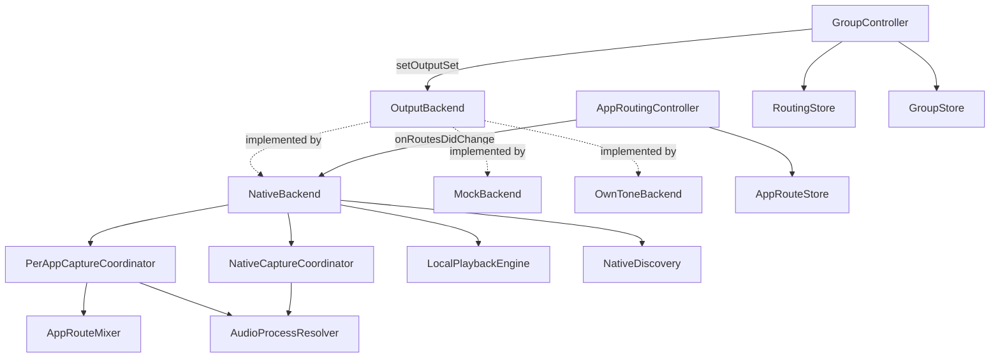

# AudiouterCore/Sources/AudiouterCore

## Purpose

This is the actual source folder for the `AudiouterCore` library target — the
UI-agnostic routing/session core: device discovery, output backends, capture
(whole-system + per-app), the routing "brain" (Selected Devices/Main Out/
groups/per-app redirects), local playback, persistence, and the first-run
setup/permissions flow. It owns everything up to the `OutputBackend` protocol
seam; it never imports AppKit and knows nothing about windows, popovers, or
views (those live in `AudiouterSharedUI`/UI targets, one level up). The
package-level [../AGENTS.md](../AGENTS.md) carries the full behavioral
Rules list and Map for this folder plus the surrounding package (UI targets,
test conventions, pre-commit gate) — read it first; this file is a narrower
map of just this folder's types and their wiring, kept for faster navigation
when a task is scoped to core logic only.

**Keep this file up to date** when: a new top-level coordinator/controller is
added or removed, the routing/capture data flow changes (a new hop is added
or an existing one is rewired), a type moves in/out of this folder, or a
external (non-Apple) dependency is added/dropped.

## Notable Patterns

See [../AGENTS.md](../AGENTS.md) Rules for the authoritative, line-by-line
invariants (redirect routing path, metering sources, volume-seed race,
`Device.isSelected` vs. `GroupController.isSpeakerSelected`, multi-process
bundle-ID resolution, `.currentDevice` anti-feedback guard, etc.) — those
apply directly to the files in this folder and are not restated here to
avoid drift between two copies.

## Architecture

`GroupController` and `AppRoutingController` are the two routing-decision
owners; both talk to whichever `OutputBackend` is active only through the
protocol, never a concrete type. `NativeBackend` is the shipping
implementation and is the only one that wires up real Core Audio capture
(`NativeCaptureCoordinator`, `PerAppCaptureCoordinator`) and local playback
(`LocalPlaybackEngine`).

## Feature Flow

Selecting a device as a Main Out / Selected Device target:
1. UI calls into `GroupController`, which updates `selectedDeviceIDs`/
   `mainOutMemberIDs` and persists via `RoutingStore`/`GroupStore`.
2. `GroupController.applyRouting` computes the live output set (Selected
   Devices minus the local Mac) and calls `OutputBackend.setOutputSet`.
3. `NativeBackend` reconciles: opens/closes AirPlay sessions per device and
   gates `NativeCaptureCoordinator`'s whole-system tap off `expectedSelected`.
4. Device state changes (connect/fail/level/volume) flow back as
   `BackendEvent`s that `GroupController`/UI observe.

Redirecting one app to a specific device:
1. UI calls into `AppRoutingController`, which updates the app's
   `AppRouteDestination` and persists via `AppRouteStore`.
2. `AppRoutingController.onRoutesDidChange` fires; the app wires this to
   `NativeBackend.updateAppRoutes(_:excludedBundleIDs:)` (`AppRouteConfiguring`).
3. `PerAppCaptureCoordinator` starts a tap for the app's full process set
   (`AudioProcessResolver`); `AppRouteMixer` mixes per-app streams into a
   per-destination stream and applies per-app volume.
4. The redirected app's audio never joins `setOutputSet`'s whole-system mix.

## Key Types

| Area | Types |
|---|---|
| Domain models | `Device`, `ConnectionState`, `ConnectionFailure`, `BackendEvent` |
| Backend seam | `OutputBackend`, `NativeBackend`, `MockBackend`, `OwnToneBackend`, `makeBackend(_:)` |
| Whole-system capture | `CaptureCoordinator`, `NativeCaptureCoordinator`, `AudioProcessResolver` |
| Per-app capture/mix | `PerAppCaptureCoordinator`, `AppRouteMixer` |
| Routing brain | `GroupController`, `AppRoutingController`, `PhaseController` |
| Persistence | `AppRouteStore`, `RoutingStore`, `GroupStore`, `AppSettings`, `ExcludedAppsStore`, `ExcludedAppsController`, `DeviceIconStore` |
| Local playback | `LocalPlaybackEngine`, `SyncedLocalSink`, `LocalOutputLatency`, `DefaultOutputObserver`, `SystemOutputVolume` |
| Discovery/diagnostics | `NativeDiscovery`, `ConnectionDiagnostics`, `Telemetry`, `AudioDiag` |
| Setup/permissions | `SetupModel`, `AudioCapturePermissionProbe`, `LocalNetworkPrimer`, `RemoteControlPrimer`, `PTPHelperService`, `SystemAudioCaptureTCC` |
| Misc infra | `DACPServer`, `FIFOManager`, `AppRelaunchCommand`, `HeadlessRuntime`, `ObjCExceptionCatching` |

## External Dependencies

| Dependency | Usage |
|---|---|
| `AirPlayEngine` | Vendored/local package driving the native AirPlay 2 protocol; `NativeBackend` and `LocalPlaybackEngine` are its main callers here. |
| `PTPHelperService` / `SMAppServicePTPHelper` | Talks to the privileged PTP helper daemon (see [PTPHelperService.swift](PTPHelperService.swift)). |

## Tests

Test files live in [../../Tests/AudiouterCoreTests](../../Tests/AudiouterCoreTests)
(57 files, one suite roughly per type above). Two conventions apply
repo-wide and are detailed in [../AGENTS.md](../AGENTS.md): subclass
`IsolatedTestCase` instead of touching `UserDefaults.standard`/shared temp
dirs directly, and use `Telemetry._installTestSink(_:)` to assert a
subsystem's own emissions rather than adding ad hoc logging hooks.
