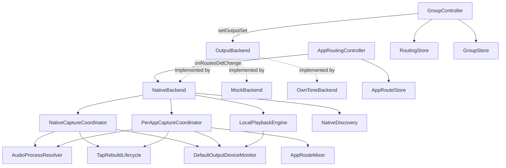

# AudiouterCore/Sources/AudiouterCore

## Purpose

This is the actual source folder for the `AudiouterCore` library target — the
UI-agnostic routing/session core: device discovery, output backends, capture
(whole-system + per-app), the routing "brain" (Selected Devices/Main Out/
groups/per-app redirects), local playback, persistence, and the first-run
setup/permissions flow. It owns everything up to the `OutputBackend` protocol
seam; it never imports AppKit and knows nothing about windows, popovers, or
views (those live in `AudiouterSharedUI`/UI targets, one level up). The
package-level [../AGENTS.md](../AGENTS.md) carries the full behavioral
Rules list and Map for this folder plus the surrounding package (UI targets,
test conventions, pre-commit gate) — read it first; this file is a narrower
map of just this folder's types and their wiring, kept for faster navigation
when a task is scoped to core logic only.

**Keep this file up to date** when: a new top-level coordinator/controller is
added or removed, the routing/capture data flow changes (a new hop is added
or an existing one is rewired), a type moves in/out of this folder, or a
external (non-Apple) dependency is added/dropped.

## Notable Patterns

See [../AGENTS.md](../AGENTS.md) Rules for the authoritative, line-by-line
invariants (redirect routing path, metering sources, volume-seed race,
`Device.isSelected` vs. `GroupController.isSpeakerSelected`, multi-process
bundle-ID resolution, `.currentDevice` anti-feedback guard, etc.) — those
apply directly to the files in this folder and are not restated here to
avoid drift between two copies.

## Architecture

`DefaultOutputDeviceMonitor` is the single process-wide owner of the shared
default output device's identity and nominal sample rate: one HAL listener
pair, fanned out to subscribers (both capture coordinators and
`LocalPlaybackEngine`), watcher-only (never writes device config).
`TapRebuildLifecycle.swift` holds the two pieces of the two coordinators'
tap-rebuild machinery that are genuinely identical (`TapRebuildCoalescer`,
`TapReanchor`); the claim/teardown/commit choreography itself is still two
separate bodies, one per coordinator, by deliberate design (see
`docs/notes/architecture-review-audio-routing-2026-07-26.md`,
"Correction" section, defect A).

`GroupController` and `AppRoutingController` are the two routing-decision
owners; both talk to whichever `OutputBackend` is active only through the
protocol, never a concrete type. `NativeBackend` is the shipping
implementation and is the only one that wires up real Core Audio capture
(`NativeCaptureCoordinator`, `PerAppCaptureCoordinator`) and local playback
(`LocalPlaybackEngine`).

### Pause-on-call (whole-system HFP handling)

When the tapped output device enters a Bluetooth headset's CALL (HFP) profile —
`DefaultOutputDeviceMonitor` delivers a settled nominal rate that rounds to
`<= 16000` on a Bluetooth transport, classified by the pure `CallProfileDecision`
— `CoreAudioSystemTap`'s monitor `onChange` reports the CURRENT profile via
`onCallActiveChanged(true)` and RETURNS EARLY, deliberately SUPPRESSING the usual
rebuild (rebuilding would re-anchor the whole pipeline onto the 16 kHz HFP clock
and capture the call). `NativeCaptureCoordinator` then gates captured audio off
stream 0 (the `callActive` flag, mirrored into the RT `BufferSnapshot`) and starts
a `SilenceFeeder`: a `DispatchSourceTimer` writing zero S16LE/44100/2ch buffers to
the same `sink` at the capture cadence, with pts stamped off the shared
`monotonicNowNanos()` (the SAME `CLOCK_MONOTONIC` timeline the captured pts are
rebased onto). This keeps the RTP session fed — the engine's ~2 s buffer would
otherwise underrun across the ~2 s HFP-switch capture starvation and clip the
receiver — while never forwarding the call audio. The feeder is the SOLE stream-0
writer while active (capture drops, feeder writes — never both).

**The COORDINATOR is the single owner of the call-active decision.** The gate +
feeder are reconciled to `active` by one idempotent apply,
`NativeCaptureCoordinator.applyCallActive(_:)` (enter: gate before feeder; exit:
feeder-stop before un-gate). Two callers drive it: (1) the tap's
`onCallActiveChanged`, which now reports its CURRENT profile on every delivery —
NOT an enter/exit edge; and (2) a RE-DRIVE after EVERY freshly-built tap commits
(both `start()`'s and `recreateTap`'s commit), passing `newTap.isCallProfile`
(committed `format.sampleRate` + a live transport read). The re-drive is
load-bearing, not defensive: the enter/exit edge and HFP-rate tracking live on the
`CoreAudioSystemTap` INSTANCE, which is destroyed/recreated on every rebuild, while
the gate + feeder live on the coordinator (survives rebuilds). A mid-call
`.exclusionChange`/membership rebuild (NOT suppressed during a call) used to mint a
fresh tap whose edge state read "not in a call" while `callActive` stayed latched
true; the new tap then never fired the exit edge and the gate stuck into permanent
silence. `callActive` is deliberately NOT cleared inside `recreateTap` — it
persists across the swap so a mid-call rebuild's new 16 kHz capture is gated from
its first buffer (no leak window) — and is reconciled only by the commit re-drive:
a 16 kHz HFP tap → `apply(true)` keeps the pause; an A2DP tap → `apply(false)`
self-heals a latched gate. A tap-build failure during a call stops the feeder on
entering `.failed` (no stranded writer); the recovery `start()`'s re-drive restarts
it iff the recovered tap is still a call profile. On the return to A2DP the monitor
re-fires (`CoreAudioSystemTap` tracks the live HFP rate while paused precisely so
this divergence is seen), the coordinator un-gates + stops the feeder, and the
tap's existing `onDefaultDeviceChanged` rebuild re-anchors — no new recovery path.
`callActive` is also cleared on `start()`/`stop()`/`deinit`, so it can never latch
into permanent silence. WHOLE-SYSTEM (stream 0) ONLY; per-app is untouched.

**KNOWN LIMITATIONS** (documented from adversarial review; NOT fixed here):
- (C) A call start that rides in behind an unrelated `F-SETTLE` settle burst can
  delay the pause by up to ~1.2 s, briefly leaking call audio to the receiver
  before the gate engages.
- (D) LE-Audio media playing at `<= 16 kHz` on a Bluetooth-LE transport can be
  misclassified as a call by `CallProfileDecision` (rate+transport only).
- (E) A speakerphone call routed through the Mac's OWN speakers is NOT paused —
  the scope is HFP (Bluetooth headset) profiles only.

## Feature Flow

Selecting a device as a Main Out / Selected Device target:
1. UI calls into `GroupController`, which updates `selectedDeviceIDs`/
   `mainOutMemberIDs` and persists via `RoutingStore`/`GroupStore`.
2. `GroupController.applyRouting` computes the live output set (Selected
   Devices minus the local Mac) and calls `OutputBackend.setOutputSet`.
3. `NativeBackend` reconciles: opens/closes AirPlay sessions per device and
   gates `NativeCaptureCoordinator`'s whole-system tap off `expectedSelected`.
4. Device state changes (connect/fail/level/volume) flow back as
   `BackendEvent`s that `GroupController`/UI observe.

Redirecting one app to a specific device:
1. UI calls into `AppRoutingController`, which updates the app's
   `AppRouteDestination` and persists via `AppRouteStore`.
2. `AppRoutingController.onRoutesDidChange` fires; the app wires this to
   `NativeBackend.updateAppRoutes(_:excludedBundleIDs:)` (`AppRouteConfiguring`).
3. `PerAppCaptureCoordinator` starts a tap for the app's full process set
   (`AudioProcessResolver`); `AppRouteMixer` mixes per-app streams into a
   per-destination stream and applies per-app volume.
4. The redirected app's audio never joins `setOutputSet`'s whole-system mix.

## Key Types

| Area | Types |
|---|---|
| Domain models | `Device`, `ConnectionState`, `ConnectionFailure`, `BackendEvent` |
| Backend seam | `OutputBackend`, `NativeBackend`, `MockBackend`, `OwnToneBackend`, `makeBackend(_:)` |
| Whole-system capture | `CaptureCoordinator`, `NativeCaptureCoordinator`, `AudioProcessResolver`, `SilenceFeeder`, `CallProfileDecision` |
| Per-app capture/mix | `PerAppCaptureCoordinator`, `AppRouteMixer` |
| Shared capture infra | `DefaultOutputDeviceMonitor`, `TapRebuildLifecycle` (`TapRebuildCoalescer`, `TapReanchor`) |
| Routing brain | `GroupController`, `AppRoutingController`, `PhaseController` |
| Persistence | `AppRouteStore`, `RoutingStore`, `GroupStore`, `AppSettings`, `ExcludedAppsStore`, `ExcludedAppsController`, `DeviceIconStore` |
| Local playback | `LocalPlaybackEngine`, `SyncedLocalSink`, `LocalOutputLatency`, `DefaultOutputObserver`, `SystemOutputVolume` |
| Discovery/diagnostics | `NativeDiscovery`, `ConnectionDiagnostics`, `Telemetry`, `AudioDiag` |
| Setup/permissions | `SetupModel`, `AudioCapturePermissionProbe`, `LocalNetworkPrimer`, `RemoteControlPrimer`, `PTPHelperService`, `SystemAudioCaptureTCC` |
| Misc infra | `DACPServer`, `FIFOManager`, `AppRelaunchCommand`, `HeadlessRuntime`, `ObjCExceptionCatching` |

## External Dependencies

| Dependency | Usage |
|---|---|
| `AirPlayEngine` | Vendored/local package driving the native AirPlay 2 protocol; `NativeBackend` and `LocalPlaybackEngine` are its main callers here. |
| `PTPHelperService` / `SMAppServicePTPHelper` | Talks to the privileged PTP helper daemon (see [PTPHelperService.swift](PTPHelperService.swift)). |

## Tests

Test files live in [../../Tests/AudiouterCoreTests](../../Tests/AudiouterCoreTests)
(57 files, one suite roughly per type above). Two conventions apply
repo-wide and are detailed in [../AGENTS.md](../AGENTS.md): subclass
`IsolatedTestCase` instead of touching `UserDefaults.standard`/shared temp
dirs directly, and use `Telemetry._installTestSink(_:)` to assert a
subsystem's own emissions rather than adding ad hoc logging hooks.
