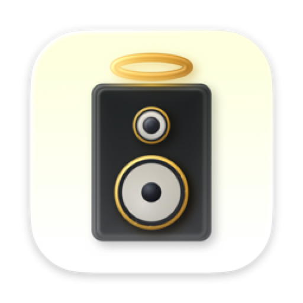
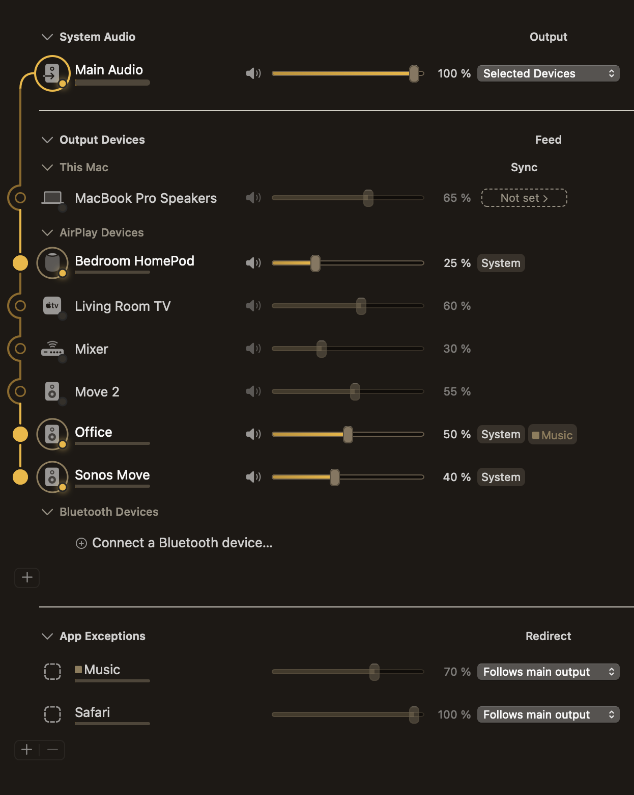

# Audiout

**Your speakers, synced at last.**

Send every sound your Mac makes to all your AirPlay speakers at once — with a
volume fader for each room, saved groups, and a phone remote.

[About](#what-it-does) · [Get Audiout](#get-audiout) · [Build from source](#or-build-it-yourself) · [iPhone remote](#audiout-remote-for-iphone) · [Docs](#documentation)

 

 

<picture>
  <source media="(prefers-color-scheme: dark)" srcset="docs/media/popover-dark.png">
  <source media="(prefers-color-scheme: light)" srcset="docs/media/popover-light.png">
  
</picture>

## What it does

macOS will happily send Apple Music to a room full of AirPlay speakers. Send it
Spotify, or a browser tab, or a game, and you get one speaker.

Audiout takes the sound leaving your Mac — all of it, whatever made it — and
sends it to as many AirPlay 2 speakers as you own, playing together in sync. Each
room gets its own fader and its own mute. You can save a set of rooms as a group
and switch to it in two clicks, and you can send one app somewhere different from
everything else: Chrome in the kitchen while the call stays on your laptop.

It runs in the menu bar. Nothing about it touches the internet — discovery,
routing, volume and playback all stay on your own network, and it keeps working
with the machine offline.

## Get Audiout

**€30, one-time.** Covers the current major version and every update until the
next major release. No subscription.

### [**Buy Audiout — €30**](https://audiout.app/buy)

You get a signed, notarised `.app` that runs the moment you drag it to
Applications — no Homebrew, no toolchain, no build step, every library it needs
already inside the bundle. Updates arrive in the app. The purchase also pays for
the work of packaging, signing, notarising and supporting it, which is the part
that a compiler cannot do for you.

## Or build it yourself

Audiout is GPL-2.0-or-later, and that is not a technicality — **if you would
rather compile it than buy it, the source here is the whole app, and it is
free.** No feature is held back, no key is required, nothing is crippled. See
[docs/BUILDING.md](docs/BUILDING.md) for the toolchain and the handful of
Homebrew libraries the source build expects.

What the paid download adds is convenience, not capability: notarisation, bundled
libraries, and in-app updates. If that is worth €30 to you, buy it. If it isn't,
build it — that path is supported and it always will be.

## Features

**Sound**
- Multi-room AirPlay 2 playback, in sync, from any app on the Mac
- Bluetooth speakers join the same synced group as AirPlay ones
- Your Mac's own speakers stay in sync with the rest of the house
- Per-device EQ and delay trim for rooms that need shaping

**Control**
- A volume fader and a mute for every speaker, live while audio plays
- Main Audio sits over everything as a ceiling — sent level is Main × Group × Device
- Groups: save a set of speakers, switch to it in two clicks
- Per-app routing — send one app to one room, leave the rest alone
- Menu-bar popover you can pin open, plus a full window for groups and settings

**The rest**
- Native AppKit, Apple Silicon, light and dark
- No cloud in the audio or control path
- VoiceOver support, Reduce Motion honoured, measured contrast in both themes

## Audiout Remote for iPhone

The house doesn't have a keyboard in it. **Audiout Remote** is a free iPhone app
that mirrors the Mac fader for fader — per-speaker volume, per-app routing, and
mute one room or all of them, from wherever you're standing.

There's no account and no sign-in. The phone finds your Mac on your own Wi-Fi,
and the Mac asks you once whether to allow that phone; after that it stays
allowed. There's no per-seat limit: put it on every phone in the house.

Free on the App Store, included with Audiout for Mac. → **[audiout.app/remote](https://audiout.app/remote)**

> [!NOTE]
> Audiout Remote is a separate app and is not part of this repository. It has no
> audio path of its own — it is a remote control for a Mac running Audiout.

## Requirements

| | |
|---|---|
| **Mac** | Apple Silicon, macOS 14.4 or later |
| **Speakers** | Any AirPlay 2 speaker — HomePod, Sonos, Apple TV, AV receivers, smart TVs. AirPlay 1, Bluetooth and Chromecast work too. Chromecast plays the whole mix only: it can't be a per-app destination. |
| **Network** | Everything on the same Wi-Fi. Audiout asks for Local Network and system-audio recording permission on first run, and explains why. |

## Documentation

- [docs/BUILDING.md](docs/BUILDING.md) — build it from source
- [docs/SPEC.md](docs/SPEC.md) — the product spec
- [PRODUCT.md](PRODUCT.md) — who it's for, what it promises, and what it collects
- [CONTRIBUTING.md](.github/CONTRIBUTING.md) — how to file a bug or send a patch
- [SECURITY.md](.github/SECURITY.md) — reporting a vulnerability

## Privacy

Audio never leaves your network. Two things do, and both are described in full in
[PRODUCT.md](PRODUCT.md#data-collection): anonymous usage statistics, which are
**off unless you turn them on**, and a licence check-in that counts how many
machines a key is used on. Neither ever carries what you're playing, your speaker
names, or anything you type.

## License

[GPL-2.0-or-later](LICENSE). The AirPlay 2 sender is derived in part from
[OwnTone](https://github.com/owntone/owntone-server) and bundles third-party code
under GPL, BSD and MIT terms — see [NOTICE](NOTICE) for the full accounting.
