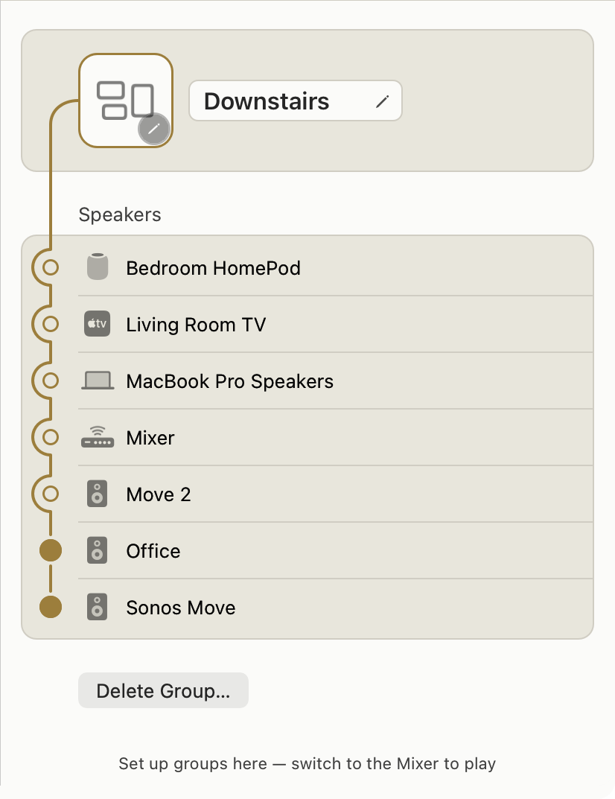
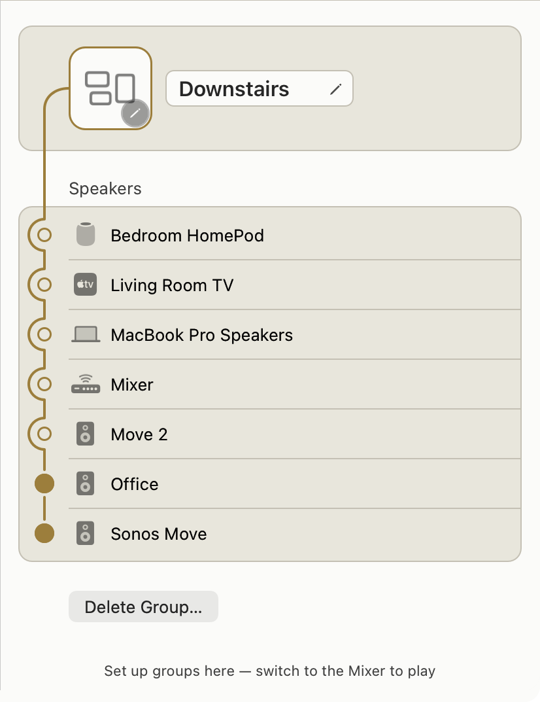
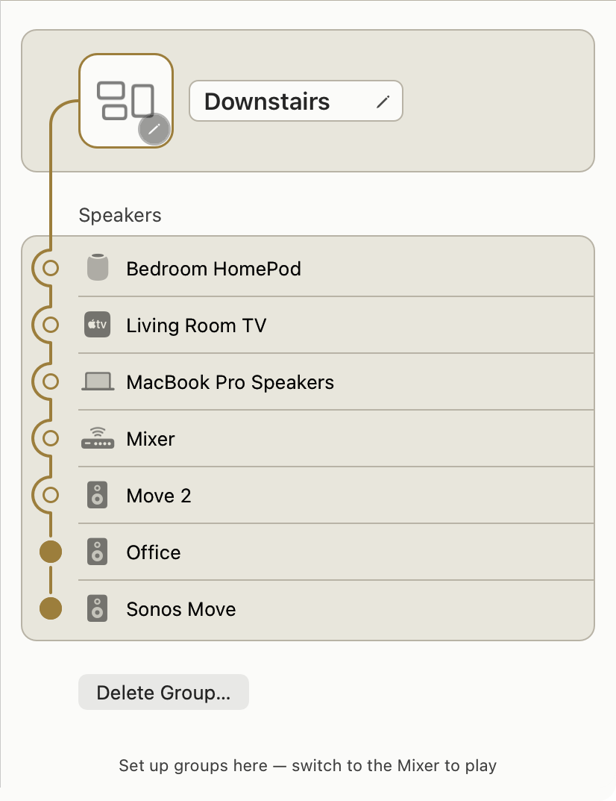
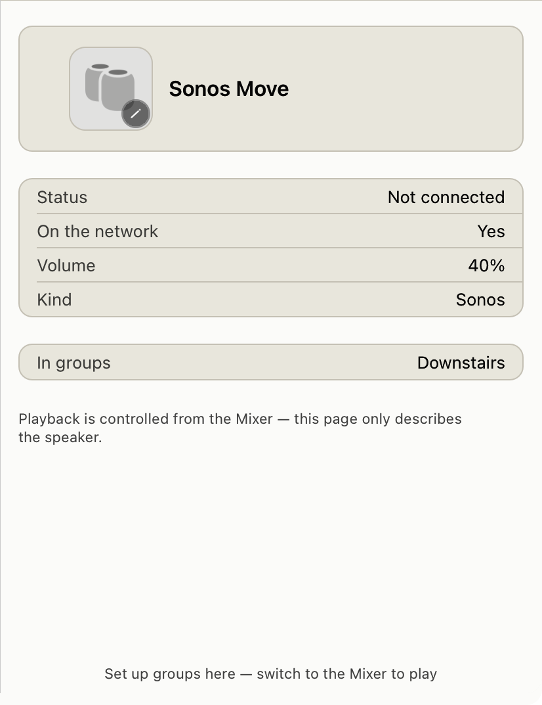
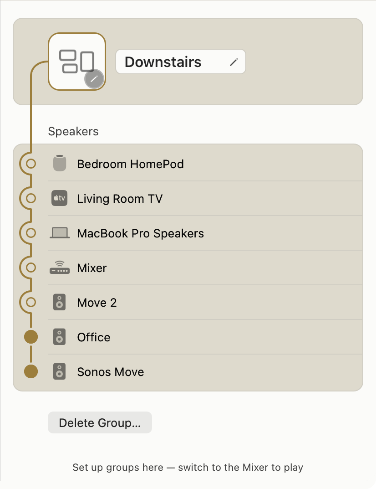
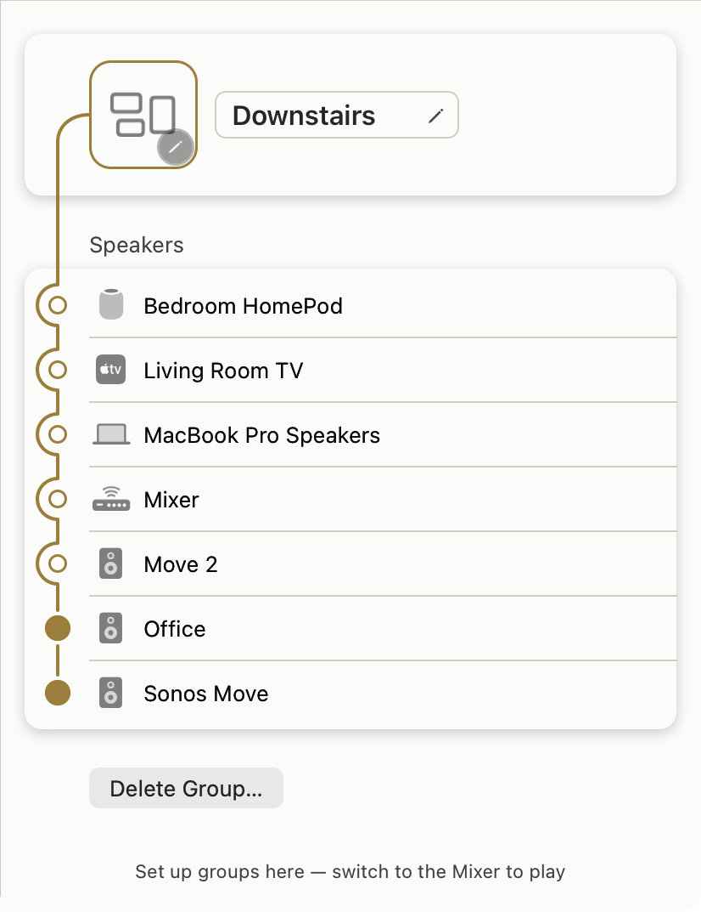
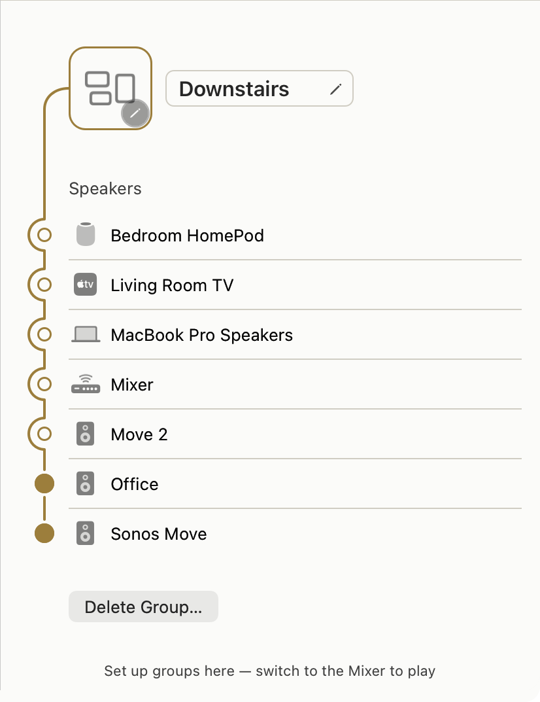

# Surface separation on a flat near-white ground — options, measured

**Status: exploration. Nothing is shipped. No shipping token was changed.**
The prototypes behind the renders live on `claude/light-separation-options` as
throwaway patches applied and reverted by `light-separation-options/render.py`;
the working tree is clean.

The brief: *the flat white ground stays.* The question is not "light mode is
flat, add elevation" — it is "we want the flat white ground, so find a
mechanism that still separates surfaces on it." One answer, both platforms.

---

## The short version

**Recommendation: keep the flat ground, and move the surface ladder from FILL
to EDGE WEIGHT.** One mechanism — the hairline — carrying two weights: a
stronger `hairline` for a container's own edge, today's lighter value for
dividers inside it. Keep `well` exactly where it is as a genuine recess, keep
the grouped-inset geometry, and adopt the same three things on iOS in place of
its stepped ladder.

Why that and not the others, in one line each:

| Option | Verdict | The measured reason |
|---|---|---|
| 1. Hairline borders | **Recommended** | The only lever with zero cost. Nothing is ever drawn *on* a hairline, so moving it spends no text and no instrument contrast. Headroom to 2.0:1 and beyond. |
| 2. Recessed | **Cannot carry the model** | `well` has a legal band of `#EBEBE2`…`#E6E6DB` — about 0.05 of contrast travel, and today's value is already at the dark end of it. Any deeper and `gold` drops under 3:1. |
| 3. Shadow | **Rejected as the primary** | Reaches 1.35:1 in the real render, but its darkest pixel is a neutral grey the palette does not contain, and it does not nest. |
| 4. Inset geometry | **Necessary, not sufficient** | Measured 1.000:1 — with fills flat and no edge, there is literally no boundary pixel. It is what keeps hairlines from colliding, not what separates. |
| 5. Combination | **This is the answer** | Hairline (edge) + inset (rhythm) + `well` (recess, unchanged). |

The one genuine surprise is in [§6](#6-the-flat-ground-is-the-best-ground-for-text).

---

## How this was measured

WCAG 2.x relative luminance, computed by
`light-separation-options/measure.py` (throwaway, on this branch). Floors, all
independently re-derived from source rather than taken from any doc:

| Floor | Value | Pinned by |
|---|---|---|
| Surface separation | 1.10:1 | `MembershipWellContrastTests.wellClearsTheContainerFloor` |
| Separator | 1.25:1 | `…hairlineClearsTheSeparatorFloor` |
| `raised` vs `well` | 1.15:1 | `…raisedClearsTheWellFloor` — **a third pinned floor the brief did not mention; it constrains this problem as hard as the other two** |
| Non-text instrument | 3:1 | WCAG 1.4.11; enforced for `gold`/`ember` on **both** `panel` and `well` |
| Body text | 4.5:1 | WCAG 1.4.3 |

Renders are the real `window-snapshot` tool driving the real
`MixerWindowController` through the real `AppSurfaceController` shell, with the
prototype patch applied to the real `Tokens.swift` / `GroupedSectionView.swift`
and reverted afterwards. Every ratio quoted from a render was read back out of
the PNG's actual pixels, not predicted.

### A doc correction, found on the way

`GroupedSectionView.swift:16-19` states light `well` vs `panel` = **1.182:1**
and light `hairline` vs `panel` = **1.309:1**.  Re-measured from today's
shipping hexes those are **1.208:1** and **1.535:1**. `MembershipWellContrastTests`
carries the same staleness for `raised` vs `well` (**1.251:1** documented,
**1.208:1** actual). The numbers predate the Circuit pull that moved the light
grounds; the tests still pass because they assert floors, not the stale
literals. Harmless today, but it is three doc sites quoting numbers that are no
longer true — worth a one-line fix on whichever branch touches them next. *(I
have not fixed them here: that is a shipping-source edit and this branch is
exploration only.)*

---

## Today's baseline

**macOS** — `canvas` = `canvasHi` = `panel` = `raised` = `#FBFBF9`, `well`
`#E8E6DC`, `hairline` `#D0CDC3`.

**iOS** (`claude/ios-light-circuit`) — a stepped ladder: `canvas` `#F4F2EA` →
`canvasHi` `#F7F5EF` → `panel` `#FCFBF7` → `raised` `#FFFFFF`, `well` `#EDEAE0`.

| pair | Mac (flat) | iOS (ladder) | floor |
|---|---|---|---|
| canvas ↔ panel | **1.00:1** | 1.08:1 | 1.10 |
| panel ↔ raised | **1.00:1** | 1.04:1 | 1.10 |
| canvas ↔ well | 1.21:1 | **1.07:1** | 1.10 |
| panel ↔ well | 1.21:1 | 1.16:1 | 1.10 |
| panel ↔ hairline | 1.54:1 | 1.54:1 | 1.25 |
| well ↔ hairline | 1.27:1 | 1.32:1 | 1.25 |

Worth saying plainly: **the iOS ladder does not actually clear the floor it was
built to clear.** Its steps are ~1.04–1.08:1, below the project's own 1.10:1
surface floor, and `canvas`↔`well` — two surfaces that genuinely abut — is
1.07:1. The ladder buys perception, not measured separation. That is not an
argument against the intent behind `cb9b30a7`; it is the reason a ladder cannot
be the answer on either platform. To make those steps *measure*, the ground has
to move far enough down that it stops being a near-white ground.


*Baseline, Groups → Edit Group, light. The `well` section reads; its `hairline`
border does not (1.27:1 against the fill it outlines). The nested white
`raised` icon well inside it reads at 1.21:1.*

---

## 1. Hairline borders only

**The finding that decides this whole brief: the hairline is the only free
lever in the palette.** Every consumer of `Tokens.Color.hairline` across all
UI targets uses it as a 1 pt stroke, a border, or a divider fill — never as a
ground. Nothing is ever drawn *on* a hairline. So moving it costs **zero**
instrument contrast and **zero** text contrast. Every other mechanism spends
one to buy the other.

| hairline | vs ground `#FBFBF9` | vs `well` `#E8E6DC` | verdict |
|---|---|---|---|
| `#E7E6DF` (iOS's old value) | 1.208:1 | 1.000:1 | FAIL |
| `#D0CDC3` **(today)** | 1.535:1 | 1.271:1 | pass |
| `#C4C0B4` | **1.755:1** | **1.454:1** | pass |
| `#B8B3A6` | **2.019:1** | **1.672:1** | pass |
| `#A8A294` | 2.454:1 | 2.032:1 | pass |

Instruments and text on every ground: **identical to baseline in all rows.**
`gold` 3.67/3.04, `ember` 3.71/3.07, `label` 14.62, `secondaryLabel` 3.93 —
unchanged, because the fills never moved.

Read out of the rendered pixels, in the gutter between two sections:

| render | darkest boundary pixel | measured vs the ground beside it |
|---|---|---|
| baseline | `(208,205,195)` | 1.535:1 |
| `#C4C0B4` | `(196,192,180)` | 1.755:1 |
| `#B8B3A6` | `(184,179,166)` | 2.019:1 |


*`#C4C0B4`. The container edge becomes a drawn thing rather than an implication.*


*`#B8B3A6`. Crisper still — but the internal dividers darkened by the same
amount, and the list starts to read as ruled paper. This is the argument for
two weights, below.*

**Does it hold when surfaces nest?** This is the real test, and it is where
Option 4 becomes non-optional. On a flat ground a raised well inside a panel
inside a canvas is three coincident fills; nesting depth is carried *only* by
how many hairlines you have crossed. Two consequences, both visible:

- **Where two hairlines meet, they must not touch.** An inner container's edge
  abutting an outer container's edge is two 1 pt lines that read as one 2 pt
  line — a heavier rule, not two boundaries. The gutter is what makes them read
  as two. In `device-detail` below the three sections are separated by real
  gutters and the stack reads unambiguously.
- **At a card's corner radius** the stroke stays crisp: `GroupedSectionView`
  already insets its stroke by half the border width so the line sits on the
  boundary rather than straddling the pixel edge. Nothing in the stronger value
  changes that — I saw no corner artefact at either `#C4C0B4` or `#B8B3A6`.


*Three stacked sections at `#C4C0B4`, each cleanly bounded, on the flat ground,
with the nested `raised` icon well inside the top one. This is the mechanism
working at depth.*

### The refinement: two weights, one mechanism

Give the container's **edge** the stronger value and leave **internal
dividers** at today's:

| role | hex | vs ground | vs `well` | floor 1.25 |
|---|---|---|---|---|
| container edge | `#C4C0B4` | 1.755:1 | 1.454:1 | pass |
| internal divider | `#D0CDC3` (today) | 1.535:1 | 1.271:1 | pass |

The edge is 1.143:1 against the divider — enough to rank them, not enough to
read as two different materials. **The surface ladder does not disappear; it
moves from fill to edge weight.** That is a ladder that costs nothing, works on
a ground of any lightness, and is exactly what the flat ground has room for.

*(This needs one small change in `GroupedSectionView.draw`: the container
stroke and the inset divider fill currently both read `Tokens.Color.hairline`.
Two token cases, or one plus a derived lighter companion. Not prototyped as a
separate render — the two weights are visible individually in 01 and baseline.)*

---

## 2. Recessed — and why it cannot carry the model

`well` is squeezed from **both** sides at once, and the gap between them is
tiny:

- Lighter than `#EBEBE2` → fails the **1.10:1** surface floor and the
  **1.15:1** `raised`-vs-`well` floor.
- Darker than `#E6E6DB` → **`gold` drops under 3:1**, disqualifying the accent
  on the surface the group editor actually draws it on.

```
     well   vs ground    gold   raised/well
  #EFEFE8      1.115:1   3.29        1.115:1
  #EBEBE2      1.157:1   3.17        1.157:1   <- legal band opens
  #E8E6DC      1.208:1   3.04        1.208:1   <- today, near the dark end
  #E6E6DB      1.213:1   3.02        1.213:1   <- legal band closes
  #E5E5D9      1.225:1   2.99        1.225:1
  #DEDACD      1.350:1   2.72        1.350:1
```

**The entire legal range for `well` is 1.157:1 … 1.213:1 — about five
hundredths of a contrast point, and today's value already sits at the dark end
of it.** There is no travel left. A mechanism whose whole dynamic range is
0.05 cannot be the primary way this app separates surfaces.

Pushing past it, as the brief asked me to try, disqualifies things explicitly:

| at `well` = `#DEDACD` (1.35:1) | ratio | verdict |
|---|---|---|
| `gold` `#A67C1E` | 2.72:1 | **DISQUALIFIED** (<3:1) |
| `ember` `#9C7E3C` | 2.75:1 | **DISQUALIFIED** |
| `caution` `#B3701C` | 2.86:1 | **DISQUALIFIED** |
| `faderThumb` `#8A7A62` | 2.98:1 | **DISQUALIFIED** |
| `hairline` `#D0CDC3` vs the well | 1.14:1 | **below the 1.25 separator floor** — the border vanishes |

That last row is the quiet one: deepening the recess also **silently kills the
container's own border**, because the border is measured against the fill it
outlines. Recession and hairline are not independent; spending one costs the
other.


*`well` at `#DEDACD`. The recess reads — and the gold nodes have visibly lost
bite, the border has gone, and the flat white ground has stopped being the
subject of the screen. Four disqualifications for one step of separation.*

**Verdict:** recession stays, exactly as it is, for the things that genuinely
recede — the fader trough, the grouped section, the sync drawer. It is a good
mechanism at the one value it is allowed to have. It cannot be the model.

---

## 3. Elevation via shadow

Prototyped honestly: section fill set to the **same** `#FBFBF9` as the ground,
no border, separation from a shadow alone — black at 0.20, 8 pt blur, 2 pt down.

Measured from the render's actual pixels, the darkest shadow pixel in the
gutter is `(218,218,216)` = **1.351:1** against the ground. It clears the
1.10:1 surface floor, and it reads better than I expected.



Three problems, in increasing order of seriousness.

**It is the wrong hue, and this is measurable.** The hairline's darkest pixel
is `(208,205,195)` — R−B = **13**, a warm greige that belongs to the palette.
The shadow's is `(218,218,216)` — R−B = **2**, effectively neutral. On a warm
near-white ground a neutral grey is a foreign body. This is `cb9b30a7`'s "grey
smudge on paper", quantified: it is not that the shadow is too dark, it is that
it has a hue nothing else in the light palette has. Tinting the shadow warm is
possible but it is then a warm blurred edge, i.e. a soft hairline — the
mechanism from §1 with worse definition.

**It does not nest.** Look at the icon well in the render: with `raised` and
the section fill both `#FBFBF9`, the nested control has *vanished* — only its
gold ring survives. A shadow separates a shape from its ground, but two shapes
that share a ground need two shadows, and stacked shadows on white compound
into exactly the grey field this palette is trying not to have. The baseline
render's nested icon well reads at 1.21:1 because it is white-on-recess. The
shadow model has no equivalent move.

**The top edge gets nothing.** A 2 pt downward offset puts the separation under
the card. The boundary above each section is near-zero — visible in the render
as sections that feel like they are sitting on the page but not bounded by it.

For the record, the deck's rejected value: 0.4 black at 17 pt blur peaks around
0.068 effective alpha = `#EAEAE8` = **1.163:1** — barely over the surface floor
while being maximally smudgy. The measurement agrees with the commit message
that rejected it.

**Verdict:** works as a *secondary* cue on genuinely floating chrome (the
control-panel bubble already has one, correctly). Not the model.

---

## 4. Inset / grouped-table geometry

Prototyped by removing colour separation entirely: section fill = ground, no
border, no shadow. Only the insets, gutters, padding and inset dividers remain.



Measured boundary contrast in the gutter: **1.000:1.** There is no boundary
pixel. That is not a criticism, it is the definition — layout separates by
*rhythm*, and rhythm has no contrast ratio.

And it half-works. The list reads as a clean, quiet list; the inset dividers
plus the spacing do carry the row rhythm. What is lost is **containment**: the
group header stops being a bounded group and becomes floating controls, and you
cannot tell where the speaker list ends and the Delete Group territory begins.
Two sections stop reading as two things.

**Verdict: necessary, not sufficient.** Its real job in the recommendation is
the one §1 identified — the gutter is what stops two adjacent hairlines from
collapsing into one heavier rule. Spacing does not replace colour separation;
it makes the small amount of colour separation legible. The app already uses
the System Settings grouped-inset idiom at 10 pt radius and should keep it
verbatim.

---

## 5. The combination — the recommendation

Flat ground `#FBFBF9` for `canvas`/`canvasHi`/`panel`/`raised`, unchanged ·
`well` `#E8E6DC`, unchanged · `hairline` split into a stronger container edge
`#C4C0B4` and today's `#D0CDC3` for internal dividers · grouped-inset geometry
kept verbatim.

| pair | ratio | floor | |
|---|---|---|---|
| panel ↔ well | 1.208:1 | 1.10 | pass |
| raised ↔ well | 1.208:1 | 1.15 | pass |
| ground ↔ container edge | **1.755:1** | 1.25 | pass |
| well ↔ container edge | **1.454:1** | 1.25 | pass |
| ground ↔ divider | 1.535:1 | 1.25 | pass |
| well ↔ divider | 1.271:1 | 1.25 | pass |

**The fill/text tug-of-war: this option does not enter it.** Every container
fill is where it is today, so every text-on-container and
instrument-on-container ratio is byte-identical to baseline:

| on the flat ground | ratio | on `well` | ratio |
|---|---|---|---|
| `label` | 14.62:1 | | 12.58:1 |
| `secondaryLabel` | 3.93:1 | | 3.80:1 |
| `gold` | 3.67:1 | | 3.04:1 |
| `ember` | 3.71:1 | | 3.07:1 |
| `caution` | 3.86:1 | | 3.20:1 |
| `failure` | 5.39:1 | | 4.46:1 |
| `faderThumb` | 4.02:1 | | 3.33:1 |

That is the whole argument in one table. Options 2 and 3 buy separation by
moving a fill; this one buys it by moving an edge, and only the edge has slack.

### Instrument re-check, including the pre-existing failures

Two instruments do **not** clear 3:1 on `well` today, and neither is caused by
anything in this brief — both are unchanged in every option here:

- **`ringConnected` `#A08C66` — 2.61:1 on `well`** (3.15:1 on the flat ground).
  This is a real, current shortfall. A separate agent is retuning it for exactly
  this reason; treat the value as provisional. Note for that work: **the flat
  ground is the friendlier of the two surfaces, so retuning against `well`
  covers both.**
- **`faderRim` `#9E8D6B` — 2.59:1 on `well`.** This one is *deliberate* and
  documented on the token: "kept just under strict 3:1 in light so a 1 px ring
  reads as a rim, not a stripe, on paper." An authored exemption, not a break.

No option in this brief moves either. Option 2 would have dropped four more
instruments below floor; the recommendation drops none.

---

## 6. The flat ground is the best ground for text

The surprise, and it cuts in the owner's favour. The brief asked me to watch
the tug-of-war — pushing a container's fill away from the canvas pushes it
toward mid-tone text. Measured on the iOS ladder, which is the only place in
either platform where the grounds actually differ:

| iOS ink | on `canvas` `#F4F2EA` | on `panel` `#FCFBF7` | on a flat `#FBFBF9` |
|---|---|---|---|
| `label` `#1E1C1C` | 15.13:1 | 16.38:1 | **16.37:1** |
| `label2` `#706464` | 5.07:1 | 5.49:1 | **5.48:1** |
| `label3` `#5F5A54` | 6.09:1 | 6.59:1 | **6.59:1** |
| `gold` `#A67C1E` | 3.39:1 | 3.67:1 | **3.67:1** |
| `ember` `#9C7E3C` | 3.43:1 | 3.71:1 | **3.71:1** |

**Every ink and every instrument is at its best on the flat near-white ground,
and gets worse on every rung the ladder steps down.** The iOS ladder's own
`canvas` costs `label2` 0.4 of a contrast point and pushes `gold` to 3.39:1 —
still passing, but spending headroom to buy 1.08:1 of separation that is itself
under the project's floor.

So the two things are not in tension at all here. The flat white ground is not
a constraint the design has to work around; on the measurements it is the
correct ground, and the separation problem is a *separate* problem to be solved
with a *separate* mechanism. That is precisely the framing the brief asked for.

---

## What this means per platform

**macOS.** Three changes, all in `Tokens` plus one line of
`GroupedSectionView.draw`: add a container-edge hairline case at `#C4C0B4`
(with its light/dark/Increase-Contrast variants and a measured rationale, per
house rule 3), leave the existing `hairline` as the divider, and have the
section stroke read the new one. Nothing else moves. `MembershipWellContrastTests`
keeps passing untouched; the new case should get its own assertion at the same
1.25:1 separator floor.

**iOS.** Retire the stepped ladder and take the Mac's flat ground —
`canvas`/`canvasHi`/`panel`/`raised` all `#FBFBF9`, `well` `#E8E6DC` — plus the
same two hairline weights. It already took the Mac's `hairline`, `gold` and
`ember` in `abd41a5c`, so this completes the same reconciliation with the
grounds that commit deliberately left alone. Every iOS ink improves (table
above); nothing regresses.

**Does the answer differ between a 42 pt Mac row and a 60 pt touch row?** The
principle does not, but one parameter should. A hairline is 1 device-independent
point on both, so on a taller row it is a proportionally thinner line bounding a
larger area, and iOS is additionally read one-handed at arm's length and
outdoors. My reading — **not measured, because contrast ratio is
size-independent and I have no iOS render to check it against** — is that iOS
should either take the stronger `#B8B3A6` for container edges, or keep
`#C4C0B4` at 1.5 pt. Both hold every floor. This is a judgement call for the
owner and it is the one place I would not act without seeing it on a phone.

---

## What I could not verify

- **No iOS rendered evidence.** There is no iOS snapshot facility in the repo —
  `CompanionSnapshot` is a data-sync type, not a renderer — and the standing
  house rule is that iOS is tested on a physical phone, never the Simulator.
  The iOS section is measurement-only. Everything rendered here is macOS.
- **The Darwin 27 light-mode snapshot issue is not fully fixed.** `db198ff0`
  is present on this tree (it is in `main`), and it does pin `NSApp.appearance`.
  Stock system artwork still renders in the *host's* appearance on this machine:
  on a dark-mode host the source-list selection pill comes out solid black and
  the toolbar segmented control comes out wrong. I tried forcing it through the
  `NSUserDefaults` argument domain (`-AppleInterfaceStyle Light`) and it had no
  effect — byte-identical output. **All renders here are therefore cropped to
  the content pane**, which is 100% custom-drawn Warm Signal surface and
  unaffected. That is the right frame for this question anyway, but it means
  I have not seen these options against a correctly-rendered sidebar, and
  anyone regenerating the `window-snapshots` goldens on a dark-mode host will
  produce wrong light PNGs.
- **The two-weight hairline was not rendered as its own image.** The two weights
  appear individually (baseline = divider weight, `01` = edge weight); the
  combination of the two in one screen is inferred, not photographed.
- **`ringConnected` is provisional** and is being retuned concurrently. Its
  2.61:1 on `well` is reported as found, not as a result of anything here.
- **Perceptual claims are mine.** Every number in this brief is computed or read
  from a pixel. Sentences about how something *reads* — "starts to feel like
  ruled paper", "stops being the subject of the screen" — are judgement, and the
  renders are attached so they can be overruled.

---

## Files

| | |
|---|---|
| Renders | `dev/notes/light-separation-options/*.png` — 6 options × 2 screens, light |
| Measurement tool | `dev/notes/light-separation-options/measure.py` (throwaway) |
| Render driver | `dev/notes/light-separation-options/render.py` (throwaway) |
| Branch | `claude/light-separation-options` — pushed, **not merged** |
